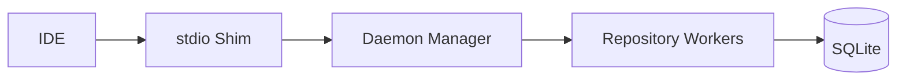

# Civyk Repo Index

[](https://www.python.org/downloads/)
[](LICENSE)
[](https://modelcontextprotocol.io/)
[](https://pypi.org/project/civyk-repoix/)
[](https://sigstore.dev/)
[](https://slsa.dev)

**Semantic code intelligence for AI coding agents** — Give your AI assistant deep understanding of your codebase through the Model Context Protocol (MCP).

> **If you find this useful, please consider [supporting the project](#support)!**

<p align="center">
  
</p>

[](https://www.youtube.com/watch?v=B4aq3cj_Pq8)

**Watch:** [What is Civyk Repo Index, why use it, and how to set it up](https://www.youtube.com/watch?v=B4aq3cj_Pq8)

______________________________________________________________________

## Local-First, Private, Secure

**Your code never leaves your machine.** Civyk Repo Index is a fully local MCP server:

- **100% offline** — No cloud services, no API calls, no telemetry
- **Your data stays yours** — All indexes and caches stored locally in SQLite
- **Works air-gapped** — Perfect for proprietary codebases and enterprise environments
- **Free binaries** — Compiled binaries available via PyPI at no cost

______________________________________________________________________

## Why Civyk Repo Index?

AI coding assistants have **limited context windows**. They can't read entire codebases. Civyk Repo Index provides **token-budgeted semantic code intelligence**:

- **Symbol-aware search** — Find functions, classes, and types instantly
- **Smart context packs** — Auto-select relevant code within token budgets
- **Relationship tracking** — Understand calls, imports, and inheritance
- **Real-time indexing** — Always up-to-date with your code changes
- **Multi-language** — Python, TypeScript, JavaScript, Java, Go, C#, Rust, Ruby, PHP
- **Branch-aware** — Separate indexes per git branch
- **Semantic Search** — Vector embedding-based symbol search
- **Tiered Tool Profiles** — Core/extended tiers for right-sized tool surface

______________________________________________________________________

## Quick Start

### Installation

All extras are optional — the base install is fully functional on its own. Pick the combination for the capabilities you want:

```bash
# 1) Base — indexing, symbol/semantic search, MCP tools.
#    Semantic search uses a lightweight lexical fallback (TF-IDF); no LLM features.
pip install civyk-repoix

# 2) With embeddings — local vector semantic search (sentence-transformers, offline, free)
pip install "civyk-repoix[embeddings]"

# 3) With LLM — deep-wiki generation & Q&A via an OpenAI-compatible API (OpenAI, Minimax, …).
#    (GitHub Copilot needs no extra — it uses your editor's Copilot sign-in, no SDK.)
pip install "civyk-repoix[llm]"

# 4) With both (recommended for deep-wiki) — semantic retrieval + LLM generation
pip install "civyk-repoix[embeddings,llm]"   # or the shorthand: civyk-repoix[all]
```

| Install | Adds | Enables |
|---------|------|---------|
| `civyk-repoix` | — | Indexing, symbol search, TF-IDF semantic search, all MCP tools |
| `civyk-repoix[embeddings]` | sentence-transformers, numpy | Local **vector** semantic search + wiki RAG retrieval |
| `civyk-repoix[llm]` | openai | **Deep-wiki** generation + `ask` via OpenAI-compatible APIs |
| `civyk-repoix[all]` | both of the above | Full feature set — best deep-wiki quality (RAG + LLM) |

> **Deep-wiki is opt-in.** After installing `[llm]` (or configuring GitHub Copilot), enable it with `wiki.enabled: true` and a `generation` provider. See [Deep Wiki](#deep-wiki--auto-generated-docs-your-agent-can-query).

### Setup for Your AI Agent

```bash
cd /path/to/your/project

# Interactive init (recommended)
civyk-repoix init

# Or configure specific agents (--agent is accepted as an alias of --ai)
civyk-repoix init --ai claude        # Claude Code
civyk-repoix init --ai cursor-agent  # Cursor
civyk-repoix init --ai windsurf      # Windsurf
civyk-repoix init --ai copilot       # GitHub Copilot
civyk-repoix init --ai opencode      # OpenCode
civyk-repoix init --ai kilocode      # Kilo Code
civyk-repoix init --ai antigravity   # Antigravity

# Configure all supported agents at once
civyk-repoix init --all
```

### Verify

```bash
civyk-repoix query status --action check
```

______________________________________________________________________

## MCP Tools

14 consolidated tools for code intelligence. Each tool supports multiple actions via an `action` parameter.

| Tier | Tool | Actions | Purpose |
|------|------|---------|---------|
| **Core** | `status` | `check`, `reindex`, `perf_stats`, `report` | Index health, re-indexing, performance stats, REPORT.md regeneration |
| **Core** | `search` | `symbols`, `code`, `definition` | Find symbols (substring / `A\|B` OR / LIKE), text patterns, and definitions |
| **Core** | `symbol` | `detail`, `references`, `callers`, `hierarchy`, `similar` | Symbol details, usage sites, call graphs, type hierarchy, similar symbols |
| **Core** | `file` | `symbols`, `imports`, `related` | Per-file symbol listing, import analysis, related files |
| **Core** | `files` | — | List/filter repository files |
| **Core** | `git` | `changes`, `hotspots`, `diff` | Recent changes, churn hotspots, branch diffs |
| **Core** | `explore` | — | Multi-strategy deep-dive in one call |
| **Core** | `remember` | — | Cross-session key-value memory |
| **Extended** | `architecture` | `components`, `dependencies`, `endpoints` | Module graph, dependency analysis, API endpoints |
| **Extended** | `quality` | `dead_code`, `duplicates`, `circular_deps`, `impact` | Code health and impact analysis |
| **Extended** | `context` | `task`, `delta`, `docs`, `trace` | Token-budgeted context packs |
| **Extended** | `tests` | `recommended`, `for_file`, `code_for_test` | Test discovery and mapping |
| **Extended** | `wiki` | `ask`, `generate`, `status`, `list`, `read`, `export`, `lint`, `plan`, `page_context`, `save_page` | Deep-wiki generation + grounded Q&A; agent-session mode (`/repoix-wiki`, no API key) via plan/page_context/save_page |
| **Extended** | `config` | `list`, `get`, `set`, `reset` | Read and change repoix settings (wiki, embeddings, daemon) without editing files |

______________________________________________________________________

## Static Repo Report — One Read to Orient

Every index pass regenerates `memory/codebase-index/REPORT.md`: a pre-digested
structural overview (components and layering — with a directory-map fallback
when component detection covers too little of the repo, component
dependencies, likely entry points, most-referenced and highest fan-out
symbols, a test-suite overview, 30-day change hotspots) inside a ~2-3K token
budget. Both ends of every counted reference must be production code — a test
calling a function is not evidence that the codebase depends on it — so the
rankings reflect the production surface. Any agent — in any client, with no MCP
setup — orients itself with a single file read instead of a grep sweep.

- **Graph confidence.** References resolve by name, so every edge records how it
  was resolved — `local` (same file), `import` (a module this file imports),
  `unique` (the only definition of that name), or `ambiguous` (a guess among
  equals). **Only evidence-backed edges rank**; the report states the mix, so a
  guess is never presented as a fact, and a report built on an unresolved graph
  says so instead of publishing a plausible-looking table.
- **`memory/codebase-index/graph.json`** ships beside the report: the same
  file-level dependency graph, machine-readable (nodes = production files with
  `path`, `language`, `symbols` and `component`; edges = weighted file→file
  references, one row per resolution, plus a `provenance` summary and a
  top-level `scope` stating what the graph covers) for agents
  that want to query structure rather than read prose.
- Refreshed automatically after full/delta index passes and watcher-indexed
  changes (atomic writes, coalesced and rate-limited under bursts).
- Regenerate on demand: `status(action="report")` (MCP), `civyk-repoix report`
  (CLI, `--print` to stdout), or the `/repoix-map` skill (see below).
- The header states generation time and index freshness so staleness is
  always visible.

______________________________________________________________________

## Deep Wiki — Auto-Generated Docs Your Agent Can Query

**A Devin DeepWiki–style knowledge base for your repo — built either by your agent's own
session LLM via the `/repoix-wiki` skill (no API key needed) or by any OpenAI-compatible
model (OpenAI, Minimax, OpenRouter, local servers, …) — and queryable over MCP/CLI.**

> **New: agent-session generation.** `/repoix-wiki` drives `wiki(action="plan")` →
> `page_context` → `save_page`: the tools own page identity (a **pinned plan of record** —
> ids never churn between builds), staleness, grounding, and storage; your agent writes and
> *surgically edits* the prose. Works without `wiki.enabled`, the `[llm]` extra, or any
> API credential. Wikis maintained this way are protected from automatic API-LLM rebuilds.

The `wiki` tool builds a structured, navigable wiki grounded in your actual code via semantic
retrieval (RAG). Each page type has its **own aspect-specific sections** (overview, architecture,
getting-started, data models, API/endpoints, and module pages), plus **detector-gated pages** that
appear only when your repo has them: **Configuration, Dependencies, Errors & Exceptions, Key Flows,
and Examples**. Overview and architecture are synthesized **bottom-up** from per-module digests for
consistency. Each page carries **`[path:Lstart-Lend]` citations to real files**, relevance-gated
inline **Mermaid diagrams**, a human `README.md` landing page (navigation + per-page table) with a
0–100 **quality score**, and a machine-readable `manifest.json`. The **module page set is planned
dynamically by the LLM** from the real source tree, while code guarantees ~100% coverage of the
**production surface** (every indexed source file except test code — tests *ground* pages via the
Examples page and each page's "tests covering this code" block, rather than being documented as
subsystems; set `wiki.include_tests: true` for a repo whose product is a test suite) and prunes
pages that leave the plan.

**Inline diagrams** (embedded in each page, **only when they add meaning** — trivial single-node or
edgeless graphs and short sequence diagrams are dropped):

- **Deterministic, from the symbol/edge graph** (no hallucination): component dependencies, a
  whole-system **data-flow** with upstream/downstream external systems (CLI, MCP client, LLM API,
  embeddings, SQLite, git, filesystem), per-module data-flow (providers → module → consumers), and
  class diagrams.
- **LLM-proposed, then validated** against the indexed symbols: **sequence diagrams** for key flows
  on the architecture and high-importance module pages.

Output is written under your repo at `memory/deep-wiki/<branch>/` (`pages/*.md`, `README.md`,
`manifest.json`, plus `business-context.json` and `digests.json` caches), branch-aware, primary
branch `main`/`master` (configurable). A grounded **business-context** pre-pass (product purpose,
domain entities, glossary) sharpens the overview/getting-started pages, and a compact glossary
**anchor** is fed to every page so terminology stays consistent. The page-synthesis prompt keeps an
identical system prefix across all pages so providers can serve it from their prompt-prefix cache.

- **Ask the wiki:** `wiki(action="ask", query="how does auth work", mode="answer")` — `rag`
  (sections + citations, no LLM cost), `answer` (LLM-synthesized), or `deep` (multi-step research).
- **Compounding research notes:** `wiki(action="ask", mode="deep", save=true)` files the answer as
  a durable **Research Notes** page (chunked + embedded), so future asks retrieve it instead of
  re-deriving the research. Notes survive rebuilds and surface as stale when their cited files
  change.
- **Owner steering:** an optional `memory/deep-wiki/steering.yaml` lets the repo owner add context
  notes, pin custom pages (`pages:` with path prefixes), emphasize topics per page or globally
  (`emphasis:`), and hide paths from the wiki (`exclude_paths:`). Steering changes automatically
  mark affected pages stale.
- **Wiki lint:** `wiki(action="lint")` runs cross-page health checks — broken/dead links, orphan
  pages, dead citations, stale pages/notes, dead/unverifiable notes, coverage gaps, deliberately
  excluded paths, duplicate titles — plus an optional LLM contradiction/duplication pass
  (`wiki.lint_llm`). The free structural tier also runs after every changed build and lands in
  the manifest.
- **Append-only audit log:** every build, filed note, and lint pass appends one grep-able line to
  `memory/deep-wiki/<branch>/log.md` — the wiki's chronological history.
- **Architecture-aware planning:** the LLM planner sees the subsystem dependency graph and entry
  points (grouping by wiring, not folder shape); page importance and grounding depth are ranked by
  **PageRank** over the file dependency graph; oversized modules (`wiki.max_files_per_page`)
  decompose into child pages with a digest-grounded parent overview.
- **Intelligent (re)generation:** triggered by a **changed-file threshold** and/or a **schedule** —
  never on every save. **Opt-in** — deep-wiki is off by default; set `wiki.enabled: true` **and**
  configure a `generation` provider to turn it on. Incremental: only pages whose sources changed
  are rebuilt.
- **Graceful degradation:** with no LLM configured it still produces structural pages + deterministic
  diagrams, and `ask` returns retrieval-only results.

### Two ways to build the wiki

**1. Agent-written (default; no API key, no LLM config).** Run **`/repoix-wiki`** in your
agent. The session's own model writes the prose; the tools own page identity, staleness,
grounding, citation validation, and storage. Nothing in `generation` or `wiki.enabled` is
consulted — those gate only the API-LLM path below. Skills are a cross-agent standard, so
this works in Claude Code, Cursor, Windsurf, and Copilot alike.

```bash
pip install "civyk-repoix[embeddings]"   # semantic retrieval; no llm extra needed
civyk-repoix init                        # installs the skills
civyk-repoix rebuild
# then, in Claude Code:  /repoix-wiki
```

**2. API-LLM (headless).** Needed when no agent is in the loop — CI/scheduled builds and
the `ask` answer/deep modes. Point `generation` at a chat model and opt the wiki in:

```bash
# 1. Install with semantic embeddings (sentence-transformers) + the OpenAI SDK
pip install "civyk-repoix[embeddings,llm]"

# 2. Provide the LLM key via env ONLY (never commit it)
export CIVYK_LLM_API_KEY=...

# 3. Initialize the repo (creates memory/codebase-index/config.yaml) and index it
civyk-repoix init
civyk-repoix rebuild                          # builds the semantic index

# 4. In memory/codebase-index/config.yaml set:
#      daemon.embedding_backend: auto          # -> local sentence-transformers when installed
#      generation.provider: minimax            # REQUIRED: any value other than the default
#                                              # `copilot` selects the OpenAI-compatible client
#      generation.base_url: https://api.minimax.io/v1
#      generation.model: MiniMax-M3            # any model that endpoint serves
#      wiki.enabled: true                      # gates the API-LLM/auto path only
#    (`provider` SELECTS the client. While it is `copilot` — the default — base_url and
#     CIVYK_LLM_API_KEY are ignored and every call goes to GitHub Copilot. An LLM counts
#     as configured once a provider+model resolve with a credential — there is no separate
#     generation.enabled switch)
civyk-repoix query wiki --action generate
civyk-repoix query wiki --action ask --query "how does indexing work" --mode answer
```

Once a wiki is agent-written, automatic API-LLM rebuilds skip it (they would overwrite the
agent's prose); an explicit `wiki(action="generate")` hands it back to the API path.

**Why the embeddings extra matters:** without it the embedding backend falls back to **tf-idf**
(keyword-only), which weakens `ask` retrieval. With `sentence-transformers` installed,
`embedding_backend: auto` uses a local semantic model (`all-MiniLM-L6-v2`, offline, free) so `ask`
retrieves by meaning. `ask` answers are grounded in both the wiki prose **and** real code
symbols/snippets pulled from the index (`wiki.code_context_token_budget`), with every citation
validated against the index.

> Already wired to DeepWiki's MCP? `read_wiki_structure`, `read_wiki_contents`, and
> `ask_question` are exposed as drop-in aliases.

### Choosing a model

Deep-wiki generation is grounded synthesis + Q&A — a capable instruction-following model with good
code comprehension and a large context window is the sweet spot. **GitHub Copilot with
`claude-opus-4.8` is the default** (see below, no API key); the table below lists OpenAI-compatible
alternatives if you'd rather use an API key. Reasoning models (e.g. MiniMax-M2.x/M3) emit a
`<think>…</think>` block that
the client strips automatically, so output stays clean; `generation.max_output_tokens` defaults to
16000 to leave headroom for the reasoning pass. Set `provider`/`base_url`/`model` in `config.yaml`
(or via the `CIVYK_LLM_*` env vars); the API key always comes from `CIVYK_LLM_API_KEY`.

| Provider | Recommended (balanced) | `base_url` | Cheaper ↓ / Stronger ↑ |
|----------|------------------------|------------|------------------------|
| **MiniMax** | `MiniMax-M3` | `https://api.minimax.io/v1` | ↑ `MiniMax-M2` (reasoning) |
| **Z.AI (GLM)** | `glm-4.6` | `https://api.z.ai/api/paas/v4` | ↓ `glm-4.5-air` |
| **OpenAI** | `gpt-5-mini` | `https://api.openai.com/v1` | ↓ `gpt-4.1-mini` / ↑ `gpt-5` |
| **Anthropic** | `claude-sonnet-4-6` | `https://api.anthropic.com/v1` | ↓ `claude-haiku-4-5` / ↑ `claude-opus-4-8` |

```bash
# Switch provider by overriding four values (key always via env). CIVYK_LLM_PROVIDER is
# REQUIRED: it selects the client, and while it stays `copilot` (the default) the base_url
# and the API key below are ignored and the calls still go to GitHub Copilot.
export CIVYK_LLM_PROVIDER=openai   # any value but `copilot` => the OpenAI-compatible client
export CIVYK_LLM_BASE_URL=https://api.z.ai/api/paas/v4
export CIVYK_LLM_MODEL=glm-4.6
export CIVYK_LLM_API_KEY=...
```

> **Note (Anthropic):** the wiki client sends `temperature`. `claude-sonnet-4-6` accepts it; the
> Opus 4.7/4.8 and Fable reasoning models reject sampling params over the API — prefer Sonnet for the
> OpenAI-compatible path. Provider model names/pricing change often — verify on the provider's docs.

### Use your GitHub Copilot subscription (the default)

GitHub Copilot is the **default** LLM provider (`generation.provider: copilot`,
`generation.model: claude-opus-4.8`), so it drives the **entire** deep-wiki pipeline (generation
**and** `ask`) with no paid API key. The built-in adapter performs the GitHub→Copilot token
exchange + refresh and sends the editor headers in-process (no separate proxy to run):

```bash
# 1. Authorize once — SKIP this if you're already signed in to Copilot in VS Code / Neovim
#    (the adapter reuses the editor's token from ~/.config/github-copilot automatically).
civyk-repoix copilot login

# 2. See which models your plan exposes (claude-*, gemini-*, gpt-5.*, …)
civyk-repoix copilot models

# 3. Generation already defaults to provider=copilot, model=claude-opus-4.8 — best deep-wiki
#    quality in our tests. Prefer speed? Pick the fast model in memory/codebase-index/config.yaml:
#      generation.model: claude-haiku-4.5    # ~6× faster, slightly shallower
#   (any id from `copilot models`; premium models like Opus require them enabled on your plan)

civyk-repoix copilot status              # verify the credential + configured model
```

> **Heads-up — the default `claude-opus-4.8` is a *premium* Copilot model.** It needs an entitled
> plan with available premium-request quota; if your plan lacks it (or the quota is exhausted),
> Copilot returns `model_not_supported` and the wiki degrades to structural (LLM-free) pages. For an
> **always-available, fast** alternative set `generation.model: claude-haiku-4.5` (≈6× faster builds,
> no premium quota, zero stubs in our tests) — or any non-premium id from `civyk-repoix copilot models`.

The GitHub credential is resolved (in priority) from `CIVYK_COPILOT_GITHUB_TOKEN` → a cached
`copilot login` → the editor's `~/.config/github-copilot/{apps,hosts}.json`; it is never written to
`config.yaml`, and the short-lived Copilot token is refreshed automatically so long builds keep
working. (A self-hosted external Copilot proxy also still works the normal way:
`provider=openai` + `base_url=<proxy>`.)

**Output length / streaming.** Responses are **streamed** by default (`generation.stream: true`,
all providers). This matters for Copilot: its non-streaming responses are capped at **16k output
tokens** per model (`max_non_streaming_output_tokens`) and a request that hits that cap comes back
empty — streaming lifts the ceiling to the model's full output limit (e.g. 64k for Claude Sonnet
4.6), so large pages generate completely. Tune `generation.max_output_tokens` to how long pages
should run and keep `generation.timeout_s` comfortably above the time to generate that many tokens
(it bounds total wall-clock per streamed call). Copilot also throttles concurrent requests per
token, so a low `wiki.concurrency` (≈2) builds most reliably. Set
`generation.stream: false` only for an endpoint that doesn't support SSE.

______________________________________________________________________

## Agent Setup

`civyk-repoix init` gives each agent three things: an MCP server entry so the tools are
callable, a rules file so the agent knows they exist, and the agent skills.

| Agent | MCP config | Rules file | Skills read from |
|-------|-----------|------------|------------------|
| Claude Code | `.mcp.json` | `.claude/rules/civyk-repoix.md` | `.claude/skills/` |
| Cursor | `.cursor/mcp.json` | `.cursor/rules/civyk-repoix.mdc` | `.cursor/skills/`, `.claude/skills/` |
| Windsurf | `.windsurf/mcp.json` | `.windsurf/rules/civyk-repoix.md` | `.windsurf/skills/` |
| GitHub Copilot | `.vscode/mcp.json` | `.github/copilot-instructions.md` | `.github/skills/`, `.claude/skills/` |

The rules file is written in whatever form the agent actually loads: Cursor ignores a
`.cursor/rules` file that carries no frontmatter (hence `.mdc` with `alwaysApply: true`),
and a Windsurf rule needs an explicit `trigger` to be always-on.

The civyk block inside that file is *managed*: re-running `init` refreshes it in place
(so an upgraded repo stops advertising tools a release removed) and leaves everything you
wrote around it untouched. It is deliberately short — it is injected into every session,
where it competes with your own instructions. The full playbook lives in the `repoix`
skill, which the agent loads only when a discovery-shaped task actually appears.

Agent skills are a cross-agent standard, so `init` installs them for every configured
agent whose skills directory is documented (the four above) — not just Claude. An agent
with no published skills directory gets the MCP server and the rules file, and `init`
says which agents it skipped rather than guessing at a path.

Because several agents read each other's directories, the skills are installed into the
directories that cover each configured agent **exactly once** — never twice: configure
Claude and Cursor together and both are served from `.claude/skills` alone; configure
Cursor alone and the skills land in `.cursor/skills` (its own directory, not a `.claude/`
one that belongs to an agent you don't use). `init` prints the resulting directory → agent
map. (Real files, not symlinks: Cursor won't follow a link out of its own tree, VS Code
rejects a linked skills directory, and git cannot commit a junction.)

```bash
civyk-repoix init              # MCP + rules file + skills + permission allow
civyk-repoix init --no-skill   # skip the project-scope agent skills
```

> **Upgrading from 1.x?** The hooks subsystem is gone. `init` strips the stale hook
> entries from your agent config, and any hook that fires before you re-run `init`
> removes them itself — so nothing breaks either way. Your own hooks are left alone.

### Making Agents Actually Use the Index — Report, Skills, Permissions

Static instructions decay over long sessions, so agents drift back to grep and re-discover
the same code every session. Three layers counter that:

1. **The static report** (`memory/codebase-index/REPORT.md`) — orientation via a plain
   file Read, the one interface every agent already prefers. No tool-selection decision
   for the model to get wrong.

2. **Three embedded skills**, surfaced at decision time rather than injected up front:
   `repoix`, a playbook (report-first defaults, task→tool routing, CLI fallback,
   freshness rules) the agent loads when a discovery-shaped task appears; `repoix-map`
   (`/repoix-map`), a user-invoked orientation flow that indexes if needed, refreshes the
   report, and summarizes it; and `repoix-wiki` (`/repoix-wiki`), which builds the deep
   wiki with the current session's model — no API key. All three are embedded in the
   executable and installed together:

   ```bash
   civyk-repoix skill install                          # user scope, Claude (~/.claude/skills)
   civyk-repoix skill install --agent cursor-agent     # user scope, Cursor (~/.cursor/skills)
   civyk-repoix skill install --scope project          # this project only (also done by init)
   civyk-repoix skill status --agent claude,windsurf   # installed versions per scope & skill
   ```

   `--agent` accepts a comma-separated list (repeatable) and defaults to `claude`; the
   directories are resolved the same way `init` resolves them. Installs are
   version-stamped — re-running after an upgrade refreshes the skills. `skill status`
   warns when a user-scope copy shadows this project's, which Claude Code allows it to do.

3. **Zero permission friction** — setup pre-allows the `mcp__civyk-repoix` server in the
   project settings, so a semantic call never costs a prompt that a plain grep doesn't.

______________________________________________________________________

## Language Support

| Tier | Languages |
|------|-----------|
| **Full** | Python, TypeScript, JavaScript |
| **Standard** | Java, Go, C#, Rust, Ruby, PHP |
| **SQL** | T-SQL, PL/SQL, Standard SQL |
| **Docs** | Markdown |

______________________________________________________________________

## Architecture

Daemon-based architecture for multi-repository support with **dual interface** — MCP protocol for AI agents or CLI for direct use.



**Key Components:**

- **Daemon Manager** — Coordinates worker lifecycle
- **Repository Worker** — One per repo, handles indexing and queries
- **Indexer** — Tree-sitter parsing, symbol extraction
- **Context Builder** — Token-budgeted context generation
- **Embedding Engine** — Vector embeddings with 3-backend fallback (sentence-transformers, API, TF-IDF)
- **Tool Health Tracker** — Auto-disables failing tools, re-enables after cooldown

### Dual Interface

| Mode | Usage | Interface |
|------|-------|-----------|
| **MCP** | AI agents (Claude, Cursor, etc.) | JSON-RPC over stdio |
| **CLI** | Direct terminal use, scripts | `civyk-repoix query <tool>` |

Both interfaces use the same underlying daemon and tool implementations — identical functionality, different access methods.

______________________________________________________________________

## CLI Mode

Use tools directly without MCP protocol:

```bash
civyk-repoix query search --action symbols --query "%User%" --kind class
civyk-repoix query context --action task --task "implement auth" --token-budget 1000
civyk-repoix query config --action list  # Show every setting and its effective value
civyk-repoix query --schema  # Get JSON schema of all tools
civyk-repoix skill install   # Install the agent skills (repoix, repoix-map, repoix-wiki)
```

**Tool Name Mapping:** MCP uses `snake_case` (e.g., `search`), CLI uses `kebab-case` (e.g., `search`). Actions are passed via `--action`.

______________________________________________________________________

## Configuration

Location (per-repo, auto-created on first daemon run, **takes precedence**):
`<repo>/memory/codebase-index/config.yaml`. Falls back to the global default
`~/.config/civyk-repoix/config.yaml`. Edit the per-repo file to set `generation`/`wiki`,
or change settings without touching files via `civyk-repoix query config --action set`.

```yaml
index:
  max_file_size_mb: 10
  debounce_ms: 5000

daemon:
  max_workers: 10
  idle_worker_timeout_s: 3600
  embedding_backend: auto  # auto, local, api, tfidf, openai

context:
  default_token_budget: 800
  max_token_budget: 4000

# Deep-wiki generation LLM. Defaults to GitHub Copilot (no API key — uses your
# editor's Copilot sign-in). For an OpenAI-compatible API instead, set provider +
# base_url and put the key in the CIVYK_LLM_API_KEY env var only — never in this file.
generation:
  provider: copilot                     # SELECTS the client: GitHub Copilot adapter, or "openai"/"minimax" for an API
  base_url: https://api.minimax.io/v1   # OpenAI-compatible endpoint (ignored when provider=copilot)
  model: claude-opus-4.8                # PREMIUM Copilot model; claude-haiku-4.5 = always-available + fast
  embedding_model: ""   # optional; enables the "openai" embedding backend

wiki:
  enabled: false              # opt-in: set true AND configure `generation` above to build the wiki
  branches: []                # empty => default branch (main/master) only
  default_branch_only: true   # lock ALL wiki gen to the default branch; ignores `branches` when on
  view: comprehensive         # comprehensive (8-12 pages) or concise (4-6)
  file_change_threshold: 25    # regenerate after N changed source files
  schedule_interval_s: 0       # 0 => disabled; else periodic build cadence (seconds)
  incremental_edits: true      # delta: reuse unchanged prose; minimal LLM edits when changed
  steering: true               # honor memory/deep-wiki/steering.yaml (owner notes/pages/emphasis/excludes)
  lint_llm: false              # wiki lint: also run the LLM contradiction/duplication pass
  max_files_per_page: 40       # split a module page into child pages above this many files
  include_tests: false         # document test code as module pages (see below)
```

> **`incremental_edits` (on by default)** keeps delta rebuilds quiet. On a delta build, a page
> whose grounding (its code snippets + deterministic diagrams) is unchanged **reuses its prior
> prose** with no LLM call — so an unrelated edit elsewhere never reword-churns the page; a page
> whose grounding *did* change is **revised** (the model edits the prior page minimally) instead of
> rewritten from scratch. Citations are re-validated against the index either way. `force=true`
> always does a full re-synthesis. Set it to `false` to re-synthesize every stale page.
>
> **`default_branch_only` (on by default)** restricts every wiki build — delta/file-change,
> scheduled, and manual `wiki(action="generate")` (including `force=true`) — to the repo's
> default branch (main/master, git-detected). Auto-triggers on other branches are silently
> skipped; a manual `generate` on another branch is refused with a `skipped` status and a
> message. Set it to `false` to build on the branches listed in `branches` (or to force-build
> on any branch). Setting this key restarts the repo's worker so it takes effect immediately.

**Environment Variables:**

| Variable | Default | Description |
|----------|---------|-------------|
| `CIVYK_LOG_LEVEL` | INFO | Log level |
| `REPOIX_PARSE_WORKERS` | CPU count | Parallel parsing workers |
| `REPOIX_CACHE_TTL` | 60 | Query cache TTL (seconds) |
| `CIVYK_EMBEDDING_BACKEND` | auto | Embedding backend: `auto`, `local`, `api`, `tfidf`, `openai` |
| `CIVYK_LLM_API_KEY` | — | API key for the OpenAI-compatible LLM (deep wiki). Ignored when the provider is `copilot`. **Secret — env only** |
| `CIVYK_LLM_BASE_URL` | — | Base URL of the OpenAI-compatible endpoint (e.g. Minimax). Ignored when the provider is `copilot` |
| `CIVYK_LLM_MODEL` | — | Chat model id used for wiki generation/Q&A |
| `CIVYK_LLM_PROVIDER` | copilot | **Selects the LLM client**, not a label: `copilot` uses the built-in adapter (and ignores `CIVYK_LLM_BASE_URL`/`CIVYK_LLM_API_KEY`); any other value (`openai`, `minimax`, …) uses the OpenAI-compatible client. Set it whenever you point at an API |
| `CIVYK_LLM_EMBEDDING_API_KEY` | — | Optional separate key for the `openai` embedding backend (falls back to `CIVYK_LLM_API_KEY`) |
| `CIVYK_LLM_EMBEDDING_MODEL` | — | Embedding model id for the `openai` backend |
| `CIVYK_WIKI_ENABLED` | false | Enable deep-wiki generation |
| `CIVYK_WIKI_FILE_CHANGE_THRESHOLD` | 25 | Changed source files before an auto-rebuild |
| `CIVYK_WIKI_STEERING` | true | Honor `memory/deep-wiki/steering.yaml` |
| `CIVYK_WIKI_LINT_LLM` | false | Wiki lint: run the LLM contradiction pass |
| `CIVYK_WIKI_MAX_FILES_PER_PAGE` | 40 | Module-page decomposition threshold |

______________________________________________________________________

## Performance

Benchmarked on Windows 11 Pro, Python 3.13, AMD Ryzen processor with a codebase of **178 files** and **7,677 symbols**.

### Tool Performance

| Tool | Avg Latency | Throughput | Category |
|------|-------------|------------|----------|
| `status --action check` | 0.5ms | 3,700+ req/s | Fast |
| `symbol --action detail` | 0.6ms | 3,600+ req/s | Fast |
| `search --action definition` | 0.6ms | 3,400+ req/s | Fast |
| `files` | 0.7ms | 3,100+ req/s | Fast |
| `file --action symbols` | 0.8ms | 2,800+ req/s | Fast |
| `search --action symbols` | 1.8ms | 600+ req/s | Medium |
| `symbol --action callers` | 2.2ms | 500+ req/s | Medium |
| `symbol --action references` | 2.5ms | 450+ req/s | Medium |
| `search --action code` | 4ms | 280+ req/s | Medium |
| `architecture --action components` | 2ms | 550+ req/s | Medium |
| `context --action task` | 16ms | 60+ req/s | Compute |
| `quality --action impact` | 35ms | 30+ req/s | Compute |
| `quality --action dead_code` | 45ms | 25+ req/s | Compute |
| `symbol --action similar` | 90ms | 12+ req/s | Compute |

### Index Performance

| Operation | Performance |
|-----------|-------------|
| Full index (178 files) | ~3 seconds |
| Delta index | < 500ms |
| Symbol search | < 2ms |
| Context pack build | < 20ms |

**Indexed scope:** git-tracked source files with `.gitignore` respected. Standard build/cache
directories (`node_modules`, `__pycache__`, `dist`, `.venv`, …) and civyk-repoix's own `memory/`
workspace (`memory/codebase-index`, `memory/deep-wiki`) are skipped.

______________________________________________________________________

## Support

**Help keep this project alive and growing!**

If Civyk Repo Index has helped your development workflow, consider supporting its continued development. Your contribution helps with:

- Ongoing maintenance and bug fixes
- New feature development
- Infrastructure costs

**50% of all donations go directly to children's charities** helping those in need. The remaining funds support project maintenance and feature upgrades.

[](https://buymeacoffee.com/civyk)
[](https://ko-fi.com/civyk)

> Every contribution, no matter the size, makes a difference.

______________________________________________________________________

## Security

All releases are cryptographically signed and include supply chain provenance.

### Verify Package Signatures

```bash
pip install sigstore
sigstore verify identity \
  --cert-oidc-issuer https://token.actions.githubusercontent.com \
  civyk_repoix-*.whl
```

### Security Features

- **Sigstore signing** on all releases
- **SLSA provenance** for supply chain security
- **OpenSSF Scorecard** for security best practices
- **100% local operation** - your code never leaves your machine

See [SECURITY.md](SECURITY.md) for our full security policy and vulnerability reporting.

______________________________________________________________________

## License

Proprietary — see [LICENSE](LICENSE)

**Free to use**: Compiled binaries are available via PyPI at no cost for personal and commercial use.
