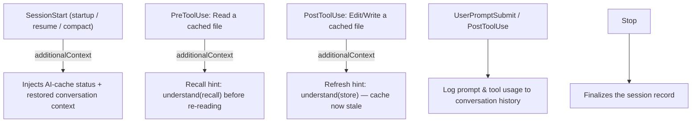
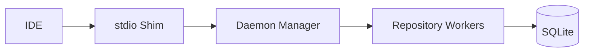

# Civyk Repo Index

[](https://www.python.org/downloads/)
[](LICENSE)
[](https://modelcontextprotocol.io/)
[](https://pypi.org/project/civyk-repoix/)
[](https://sigstore.dev/)
[](https://slsa.dev)

**Semantic code intelligence for AI coding agents** — Give your AI assistant deep understanding of your codebase through the Model Context Protocol (MCP).

> **If you find this useful, please consider [supporting the project](#support)!**

[](https://www.youtube.com/watch?v=B4aq3cj_Pq8)

**Watch:** [What is Civyk Repo Index, why use it, and how to set it up](https://www.youtube.com/watch?v=B4aq3cj_Pq8)

______________________________________________________________________

## Local-First, Private, Secure

**Your code never leaves your machine.** Civyk Repo Index is a fully local MCP server:

- **100% offline** — No cloud services, no API calls, no telemetry
- **Your data stays yours** — All indexes and caches stored locally in SQLite
- **Works air-gapped** — Perfect for proprietary codebases and enterprise environments
- **Free binaries** — Compiled binaries available via PyPI at no cost

______________________________________________________________________

## Why Civyk Repo Index?

AI coding assistants have **limited context windows**. They can't read entire codebases. Civyk Repo Index provides **token-budgeted semantic code intelligence**:

- **Symbol-aware search** — Find functions, classes, and types instantly
- **Smart context packs** — Auto-select relevant code within token budgets
- **Relationship tracking** — Understand calls, imports, and inheritance
- **Real-time indexing** — Always up-to-date with your code changes
- **Multi-language** — Python, TypeScript, JavaScript, Java, Go, C#, Rust, Ruby, PHP
- **Branch-aware** — Separate indexes per git branch
- **AI Context Cache** — Persist code understanding across sessions, save 80-90% tokens
- **Semantic Search** — Vector embedding-based search across understanding cache
- **Tiered Tool Profiles** — Core/extended/specialist tiers for right-sized tool surface

______________________________________________________________________

## Quick Start

### Installation

```bash
pip install civyk-repoix

# Optional: enable semantic search with vector embeddings
pip install civyk-repoix[embeddings]

# Optional: enable deep-wiki generation and Q&A (OpenAI-compatible LLMs, e.g. Minimax)
pip install civyk-repoix[llm]
```

### Setup for Your AI Agent

```bash
cd /path/to/your/project

# Interactive init (recommended)
civyk-repoix init

# Or configure specific agent
civyk-repoix init --ai claude        # Claude Code
civyk-repoix init --ai cursor-agent  # Cursor
civyk-repoix init --ai windsurf      # Windsurf
civyk-repoix init --ai copilot       # GitHub Copilot
civyk-repoix init --ai opencode      # OpenCode
civyk-repoix init --ai kilocode      # Kilo Code
civyk-repoix init --ai antigravity   # Antigravity

# Configure all supported agents at once
civyk-repoix init --all
```

### Verify

```bash
civyk-repoix query status --action check
```

______________________________________________________________________

## MCP Tools

15 consolidated tools for code intelligence. Each tool supports multiple actions via an `action` parameter.

| Tier | Tool | Actions | Purpose |
|------|------|---------|---------|
| **Core** | `status` | `check`, `reindex`, `perf_stats` | Index health, re-indexing, performance stats |
| **Core** | `search` | `symbols`, `code`, `definition` | Find symbols, text patterns, and definitions |
| **Core** | `symbol` | `detail`, `references`, `callers`, `hierarchy`, `similar` | Symbol details, usage sites, call graphs, type hierarchy, similar symbols |
| **Core** | `file` | `symbols`, `imports`, `related` | Per-file symbol listing, import analysis, related files |
| **Core** | `files` | — | List/filter repository files |
| **Core** | `git` | `changes`, `hotspots`, `diff` | Recent changes, churn hotspots, branch diffs |
| **Core** | `understand` | `store`, `recall`, `stats`, `invalidate` | AI context cache — persist and recall understanding |
| **Core** | `explore` | — | Multi-strategy deep-dive in one call |
| **Core** | `remember` | — | Cross-session key-value memory |
| **Extended** | `architecture` | `components`, `dependencies`, `endpoints` | Module graph, dependency analysis, API endpoints |
| **Extended** | `quality` | `dead_code`, `duplicates`, `circular_deps`, `impact` | Code health and impact analysis |
| **Extended** | `context` | `task`, `delta`, `docs`, `trace` | Token-budgeted context packs |
| **Extended** | `tests` | `recommended`, `for_file`, `code_for_test` | Test discovery and mapping |
| **Extended** | `wiki` | `ask`, `generate`, `status`, `list`, `read`, `export` | Deep-wiki generation + grounded Q&A over the codebase |
| **Specialist** | `conversation` | `list`, `history`, `search`, `context`, `log`, `finalize` | Conversation history across sessions |

> **Tip:** Use `understand(action="recall")` before reading files — cached analysis saves 80-90% of tokens.

______________________________________________________________________

## AI Context Cache — Your AI Remembers

**The killer feature: Your AI assistant remembers what it learned about your code.**

Traditional AI coding assistants forget everything when you start a new chat or session. With Civyk Repo Index's AI Context Cache, understanding persists:

```text
Monday:    AI reads auth.py → analyzes → stores understanding
Tuesday:   New chat → AI recalls cached understanding → no file read needed!
Wednesday: You modify auth.py → cache auto-invalidates → AI re-analyzes
```

### Why This Matters

| Without Cache | With Cache |
|---------------|------------|
| AI re-reads files every session | AI recalls previous analysis instantly |
| Wastes tokens on repeated reads | **80-90% token savings** |
| Slow context building | Sub-millisecond recall |
| Understanding lost on chat restart | **Persists across sessions and chats** |

### How It Works

1. **First encounter**: AI reads a file, analyzes it, calls `understand(action="store")`
1. **Future sessions**: AI calls `understand(action="recall")` first — gets cached analysis
1. **File changes**: Cache auto-invalidates via content hash — AI re-analyzes
1. **Per-repository**: Each repo has its own persistent cache

### Cache Tools

| Tool | Purpose |
|------|---------|
| `understand(action="recall")` | **Call FIRST** before reading any file — retrieves cached analysis |
| `understand(action="store")` | Persist AI's analyzed understanding after reading files |
| `understand(action="stats")` | **Session start**: List cached targets, filter by path/scope, sort, check freshness |
| `understand(action="invalidate")` | Manually clear cached entries when needed |

`understand(action="store")` supports structured fields (purpose, key_points, gotchas) plus a free-form `analysis` field for complex business logic, state machines, and workflows.

> **Pro tip**: The AI Context Cache is stored locally in SQLite alongside your code index. Your analysis never leaves your machine.

______________________________________________________________________

## Deep Wiki — Auto-Generated Docs Your Agent Can Query

**A Devin DeepWiki–style knowledge base for your repo, generated by any OpenAI-compatible
model (OpenAI, Minimax, OpenRouter, local servers, …) and queryable over MCP/CLI.**

The `wiki` tool builds a structured, navigable wiki grounded in your actual code via semantic
retrieval (RAG). Each page type has its **own aspect-specific sections** (overview, architecture,
getting-started, data models, API/endpoints, and module pages), plus **detector-gated pages** that
appear only when your repo has them: **Configuration, Dependencies, Errors & Exceptions, Key Flows,
and Examples**. Overview and architecture are synthesized **bottom-up** from per-module digests for
consistency. Each page carries **`[path:Lstart-Lend]` citations to real files**, relevance-gated
inline **Mermaid diagrams**, a human `README.md` landing page (navigation + per-page table) with a
0–100 **quality score**, and a machine-readable `manifest.json`. The **module page set is planned
dynamically by the LLM** from the real source tree, while code guarantees ~100% source coverage and
prunes pages that leave the plan.

**Inline diagrams** (embedded in each page, **only when they add meaning** — trivial single-node or
edgeless graphs and short sequence diagrams are dropped):

- **Deterministic, from the symbol/edge graph** (no hallucination): component dependencies, a
  whole-system **data-flow** with upstream/downstream external systems (CLI, MCP client, LLM API,
  embeddings, SQLite, git, filesystem), per-module data-flow (providers → module → consumers), and
  class diagrams.
- **LLM-proposed, then validated** against the indexed symbols: **sequence diagrams** for key flows
  on the architecture and high-importance module pages.

Output is written under your repo at `memory/deep-wiki/<branch>/` (`pages/*.md`, `README.md`,
`manifest.json`, plus `business-context.json` and `digests.json` caches), branch-aware, primary
branch `main`/`master` (configurable). A grounded **business-context** pre-pass (product purpose,
domain entities, glossary) sharpens the overview/getting-started pages, and a compact glossary
**anchor** is fed to every page so terminology stays consistent. The page-synthesis prompt keeps an
identical system prefix across all pages so providers can serve it from their prompt-prefix cache.

- **Ask the wiki:** `wiki(action="ask", query="how does auth work", mode="answer")` — `rag`
  (sections + citations, no LLM cost), `answer` (LLM-synthesized), or `deep` (multi-step research).
- **Intelligent (re)generation:** triggered by a **changed-file threshold** and/or a **schedule** —
  never on every save — and **off by default** until a provider is configured. Incremental: only
  pages whose sources changed are rebuilt.
- **Graceful degradation:** with no LLM configured it still produces structural pages + deterministic
  diagrams, and `ask` returns retrieval-only results.

### Recommended setup

For the best wiki + `ask` quality, install the **embeddings** extra (semantic retrieval) alongside
the **llm** extra and point generation at a capable chat model:

```bash
# 1. Install with semantic embeddings (sentence-transformers) + the OpenAI SDK
pip install "civyk-repoix[embeddings,llm]"

# 2. Provide the LLM key via env ONLY (never commit it)
export CIVYK_LLM_API_KEY=...

# 3. Initialize the repo (creates memory/codebase-index/config.yaml) and index it
civyk-repoix init
civyk-repoix status --action reindex          # builds the semantic index

# 4. In memory/codebase-index/config.yaml set:
#      daemon.embedding_backend: auto          # -> local sentence-transformers when installed
#      generation.enabled: true
#      generation.model: MiniMax-M3            # default; any OpenAI-compatible model
#      wiki.enabled: true
civyk-repoix query wiki --action generate
civyk-repoix query wiki --action ask --query "how does indexing work" --mode answer
```

**Why the embeddings extra matters:** without it the embedding backend falls back to **tf-idf**
(keyword-only), which weakens `ask` retrieval. With `sentence-transformers` installed,
`embedding_backend: auto` uses a local semantic model (`all-MiniLM-L6-v2`, offline, free) so `ask`
retrieves by meaning. `ask` answers are grounded in both the wiki prose **and** real code
symbols/snippets pulled from the index (`wiki.code_context_token_budget`), with every citation
validated against the index.

> Already wired to DeepWiki's MCP? `read_wiki_structure`, `read_wiki_contents`, and
> `ask_question` are exposed as drop-in aliases.

### Choosing a model

Deep-wiki generation is grounded synthesis + Q&A — a capable instruction-following model with good
code comprehension and a large context window is the sweet spot. **GitHub Copilot with
`claude-opus-4.8` is the default** (see below, no API key); the table below lists OpenAI-compatible
alternatives if you'd rather use an API key. Reasoning models (e.g. MiniMax-M2.x/M3) emit a
`<think>…</think>` block that
the client strips automatically, so output stays clean; `generation.max_output_tokens` defaults to
16000 to leave headroom for the reasoning pass. Set `provider`/`base_url`/`model` in `config.yaml`
(or via the `CIVYK_LLM_*` env vars); the API key always comes from `CIVYK_LLM_API_KEY`.

| Provider | Recommended (balanced) | `base_url` | Cheaper ↓ / Stronger ↑ |
|----------|------------------------|------------|------------------------|
| **MiniMax** | `MiniMax-M3` | `https://api.minimax.io/v1` | ↑ `MiniMax-M2` (reasoning) |
| **Z.AI (GLM)** | `glm-4.6` | `https://api.z.ai/api/paas/v4` | ↓ `glm-4.5-air` |
| **OpenAI** | `gpt-5-mini` | `https://api.openai.com/v1` | ↓ `gpt-4.1-mini` / ↑ `gpt-5` |
| **Anthropic** | `claude-sonnet-4-6` | `https://api.anthropic.com/v1` | ↓ `claude-haiku-4-5` / ↑ `claude-opus-4-8` |

```bash
# Switch provider by overriding three values (key always via env):
export CIVYK_LLM_BASE_URL=https://api.z.ai/api/paas/v4
export CIVYK_LLM_MODEL=glm-4.6
export CIVYK_LLM_API_KEY=...
```

> **Note (Anthropic):** the wiki client sends `temperature`. `claude-sonnet-4-6` accepts it; the
> Opus 4.7/4.8 and Fable reasoning models reject sampling params over the API — prefer Sonnet for the
> OpenAI-compatible path. Provider model names/pricing change often — verify on the provider's docs.

### Use your GitHub Copilot subscription (the default)

GitHub Copilot is the **default** LLM provider (`generation.provider: copilot`,
`generation.model: claude-opus-4.8`), so it drives the **entire** deep-wiki pipeline (generation
**and** `ask`) with no paid API key. The built-in adapter performs the GitHub→Copilot token
exchange + refresh and sends the editor headers in-process (no separate proxy to run):

```bash
# 1. Authorize once — SKIP this if you're already signed in to Copilot in VS Code / Neovim
#    (the adapter reuses the editor's token from ~/.config/github-copilot automatically).
civyk-repoix copilot login

# 2. See which models your plan exposes (claude-*, gemini-*, gpt-5.*, …)
civyk-repoix copilot models

# 3. Generation already defaults to provider=copilot, model=claude-opus-4.8 — best deep-wiki
#    quality in our tests. Prefer speed? Pick the fast model in memory/codebase-index/config.yaml:
#      generation.model: claude-haiku-4.5    # ~6× faster, slightly shallower
#   (any id from `copilot models`; premium models like Opus require them enabled on your plan)

civyk-repoix copilot status              # verify the credential + configured model
```

> **Heads-up — the default `claude-opus-4.8` is a *premium* Copilot model.** It needs an entitled
> plan with available premium-request quota; if your plan lacks it (or the quota is exhausted),
> Copilot returns `model_not_supported` and the wiki degrades to structural (LLM-free) pages. For an
> **always-available, fast** alternative set `generation.model: claude-haiku-4.5` (≈6× faster builds,
> no premium quota, zero stubs in our tests) — or any non-premium id from `civyk-repoix copilot models`.

The GitHub credential is resolved (in priority) from `CIVYK_COPILOT_GITHUB_TOKEN` → a cached
`copilot login` → the editor's `~/.config/github-copilot/{apps,hosts}.json`; it is never written to
`config.yaml`, and the short-lived Copilot token is refreshed automatically so long builds keep
working. (A self-hosted external Copilot proxy also still works the normal way:
`provider=openai` + `base_url=<proxy>`.)

**Output length / streaming.** Responses are **streamed** by default (`generation.stream: true`,
all providers). This matters for Copilot: its non-streaming responses are capped at **16k output
tokens** per model (`max_non_streaming_output_tokens`) and a request that hits that cap comes back
empty — streaming lifts the ceiling to the model's full output limit (e.g. 64k for Claude Sonnet
4.6), so large pages generate completely. Tune `generation.max_output_tokens` to how long pages
should run and keep `generation.timeout_s` comfortably above the time to generate that many tokens
(it bounds total wall-clock per streamed call). Copilot also throttles concurrent requests per
token, so a low `generation.max_concurrency` / `wiki.concurrency` (≈2) builds most reliably. Set
`generation.stream: false` only for an endpoint that doesn't support SSE.

______________________________________________________________________

## Conversation History — Context Across Sessions

**Your AI assistant remembers conversation context across sessions and compactions.**

When Claude Code or other AI agents hit context limits, they compact conversations — losing valuable context. With Civyk Repo Index's Conversation History, your discussions persist:

```text
Session 1:  AI discusses auth refactor → conversation logged
[Compaction happens]
Session 2:  AI calls conversation(action="context") → restores key decisions and goals
```

### Conversation Tools

| Tool | Purpose |
|------|---------|
| `conversation(action="list")` | Find recent sessions to restore context |
| `conversation(action="history")` | Retrieve turns from a specific session |
| `conversation(action="context")` | Build token-budgeted context from session history |
| `conversation(action="search")` | Full-text search across all past conversations |

> **Hook Integration**: Conversation logging integrates with Claude Code hooks to automatically capture prompts and tool usage.

______________________________________________________________________

## AI Cache Hooks — Session Continuity & Cache Hints

Civyk Repo Index installs a small set of Claude Code hooks. Everything they surface is delivered through Claude Code's `additionalContext` channel, so it actually reaches the model — a hook's `systemMessage` goes to the user terminal only and is never sent to the model:



> **The per-file hints are deliberately rare.** They fire only for a **model-authored** cached understanding (one you previously stored with `understand(store)`): `check-cache` on Read, `refresh-cache` when you Edit/Write a file whose stored understanding your edit may have outdated. The indexer auto-populates a thin structural understanding for every indexed file; those auto stubs are treated as a miss, so the hints don't fire on ordinary reads/edits. Each is one concise line via `additionalContext`, and **advisory** — the model receives it but is free to act or ignore it (it does not block the tool; for a hard guarantee you'd need a blocking `PreToolUse` deny). Earlier builds emitted these as `systemMessage` — invisible to the model yet noisy on *every* read; that is fixed, and the always-on `remind-store`/`persist-learnings`/`save-compact` nudges were dropped.

### Supported Agents

| Agent | MCP | Hooks | Config Location |
|-------|-----|-------|-----------------|
| Claude Code | Yes | Yes | `.claude/settings.json` |
| Cursor | Yes | Yes | `.cursor/hooks.json` |
| Windsurf | Yes | Yes | `.windsurf/hooks.json` |
| GitHub Copilot | Yes | Yes | `.github/hooks/` |

### Setup

Hooks are configured automatically during setup:

```bash
civyk-repoix init              # Configures MCP + hooks
civyk-repoix init --no-hooks   # Skip hook configuration
```

> **Conversation continuity**: SessionStart hooks reinject prior context after resume/compaction so long sessions keep the thread, and the logging hooks build a searchable history (see the `conversation` tool).

______________________________________________________________________

## Language Support

| Tier | Languages |
|------|-----------|
| **Full** | Python, TypeScript, JavaScript |
| **Standard** | Java, Go, C#, Rust, Ruby, PHP |
| **SQL** | T-SQL, PL/SQL, Standard SQL |
| **Docs** | Markdown |

______________________________________________________________________

## Architecture

Daemon-based architecture for multi-repository support with **dual interface** — MCP protocol for AI agents or CLI for direct use.



**Key Components:**

- **Daemon Manager** — Coordinates worker lifecycle
- **Repository Worker** — One per repo, handles indexing and queries
- **Indexer** — Tree-sitter parsing, symbol extraction
- **Context Builder** — Token-budgeted context generation
- **Embedding Engine** — Vector embeddings with 3-backend fallback (sentence-transformers, API, TF-IDF)
- **Conversation Manager** — Session tracking and history persistence
- **Tool Health Tracker** — Auto-disables failing tools, re-enables after cooldown

### Dual Interface

| Mode | Usage | Interface |
|------|-------|-----------|
| **MCP** | AI agents (Claude, Cursor, etc.) | JSON-RPC over stdio |
| **CLI** | Direct terminal use, scripts | `civyk-repoix query <tool>` |

Both interfaces use the same underlying daemon and tool implementations — identical functionality, different access methods.

______________________________________________________________________

## CLI Mode

Use tools directly without MCP protocol:

```bash
civyk-repoix query search --action symbols --query "%User%" --kind class
civyk-repoix query context --action task --task "implement auth" --token-budget 1000
civyk-repoix query conversation --action list --days 7  # View recent sessions
civyk-repoix query --schema  # Get JSON schema of all tools
```

**Tool Name Mapping:** MCP uses `snake_case` (e.g., `search`), CLI uses `kebab-case` (e.g., `search`). Actions are passed via `--action`.

______________________________________________________________________

## Configuration

Location (per-repo, auto-created on first daemon run, **takes precedence**):
`<repo>/memory/codebase-index/config.yaml`. Falls back to the global default
`~/.config/civyk-repoix/config.yaml`. Edit the per-repo file to set `generation`/`wiki`.
(Note: `memory/config.json` is a separate file for hooks/conversation settings only — wiki
settings do **not** go there.)

```yaml
index:
  max_file_size_mb: 10
  debounce_ms: 500

daemon:
  max_workers: 10
  idle_worker_timeout_s: 3600
  embedding_backend: auto  # auto, local, api, tfidf, openai

context:
  default_token_budget: 800
  max_token_budget: 4000

# Deep-wiki generation LLM. Defaults to GitHub Copilot (no API key — uses your
# editor's Copilot sign-in). For an OpenAI-compatible API instead, set provider +
# base_url and put the key in the CIVYK_LLM_API_KEY env var only — never in this file.
generation:
  enabled: false
  provider: copilot                     # GitHub Copilot adapter (or "openai"/"minimax" for an API)
  base_url: https://api.minimax.io/v1   # OpenAI-compatible endpoint (ignored when provider=copilot)
  model: claude-opus-4.8                # PREMIUM Copilot model; claude-haiku-4.5 = always-available + fast
  embedding_model: ""   # optional; enables the "openai" embedding backend

wiki:
  enabled: true               # deep-wiki on by default (still needs a configured LLM to generate)
  branches: []                # empty => default branch (main/master) only
  default_branch_only: true   # lock ALL wiki gen to the default branch; ignores `branches` when on
  view: comprehensive         # comprehensive (8-12 pages) or concise (4-6)
  file_change_threshold: 25    # regenerate after N changed source files
  schedule_interval_s: 0       # 0 => disabled; else periodic build cadence (seconds)
  incremental_edits: true      # delta: reuse unchanged prose; minimal LLM edits when changed
```

> **`incremental_edits` (on by default)** keeps delta rebuilds quiet. On a delta build, a page
> whose grounding (its code snippets + deterministic diagrams) is unchanged **reuses its prior
> prose** with no LLM call — so an unrelated edit elsewhere never reword-churns the page; a page
> whose grounding *did* change is **revised** (the model edits the prior page minimally) instead of
> rewritten from scratch. Citations are re-validated against the index either way. `force=true`
> always does a full re-synthesis. Set it to `false` to re-synthesize every stale page.
>
> **`default_branch_only` (on by default)** restricts every wiki build — delta/file-change,
> scheduled, and manual `wiki(action="generate")` (including `force=true`) — to the repo's
> default branch (main/master, git-detected). Auto-triggers on other branches are silently
> skipped; a manual `generate` on another branch is refused with a `skipped` status and a
> message. Set it to `false` to build on the branches listed in `branches` (or to force-build
> on any branch). Setting this key restarts the repo's worker so it takes effect immediately.

**Environment Variables:**

| Variable | Default | Description |
|----------|---------|-------------|
| `CIVYK_LOG_LEVEL` | INFO | Log level |
| `REPOIX_PARSE_WORKERS` | CPU count | Parallel parsing workers |
| `REPOIX_CACHE_TTL` | 60 | Query cache TTL (seconds) |
| `CIVYK_EMBEDDING_BACKEND` | auto | Embedding backend: `auto`, `local`, `api`, `tfidf`, `openai` |
| `CIVYK_LLM_API_KEY` | — | API key for the OpenAI-compatible LLM (deep wiki). **Secret — env only** |
| `CIVYK_LLM_BASE_URL` | — | Base URL of the OpenAI-compatible endpoint (e.g. Minimax) |
| `CIVYK_LLM_MODEL` | — | Chat model id used for wiki generation/Q&A |
| `CIVYK_LLM_PROVIDER` | openai | Provider label (informational) |
| `CIVYK_LLM_EMBEDDING_API_KEY` | — | Optional separate key for the `openai` embedding backend (falls back to `CIVYK_LLM_API_KEY`) |
| `CIVYK_LLM_EMBEDDING_MODEL` | — | Embedding model id for the `openai` backend |
| `CIVYK_WIKI_ENABLED` | false | Enable deep-wiki generation |
| `CIVYK_WIKI_FILE_CHANGE_THRESHOLD` | 25 | Changed source files before an auto-rebuild |

______________________________________________________________________

## Performance

Benchmarked on Windows 11 Pro, Python 3.13, AMD Ryzen processor with a codebase of **178 files** and **7,677 symbols**.

### Tool Performance

| Tool | Avg Latency | Throughput | Category |
|------|-------------|------------|----------|
| `status --action check` | 0.5ms | 3,700+ req/s | Fast |
| `symbol --action detail` | 0.6ms | 3,600+ req/s | Fast |
| `search --action definition` | 0.6ms | 3,400+ req/s | Fast |
| `files` | 0.7ms | 3,100+ req/s | Fast |
| `file --action symbols` | 0.8ms | 2,800+ req/s | Fast |
| `search --action symbols` | 1.8ms | 600+ req/s | Medium |
| `symbol --action callers` | 2.2ms | 500+ req/s | Medium |
| `symbol --action references` | 2.5ms | 450+ req/s | Medium |
| `search --action code` | 4ms | 280+ req/s | Medium |
| `architecture --action components` | 2ms | 550+ req/s | Medium |
| `context --action task` | 16ms | 60+ req/s | Compute |
| `quality --action impact` | 35ms | 30+ req/s | Compute |
| `quality --action dead_code` | 45ms | 25+ req/s | Compute |
| `symbol --action similar` | 90ms | 12+ req/s | Compute |

### Index Performance

| Operation | Performance |
|-----------|-------------|
| Full index (178 files) | ~3 seconds |
| Delta index | < 500ms |
| Symbol search | < 2ms |
| Context pack build | < 20ms |

**Indexed scope:** git-tracked source files with `.gitignore` respected. Standard build/cache
directories (`node_modules`, `__pycache__`, `dist`, `.venv`, …) and civyk-repoix's own `memory/`
workspace (`memory/codebase-index`, `memory/deep-wiki`) are skipped.

______________________________________________________________________

## Support

**Help keep this project alive and growing!**

If Civyk Repo Index has helped your development workflow, consider supporting its continued development. Your contribution helps with:

- Ongoing maintenance and bug fixes
- New feature development
- Infrastructure costs

**50% of all donations go directly to children's charities** helping those in need. The remaining funds support project maintenance and feature upgrades.

[](https://buymeacoffee.com/civyk)
[](https://ko-fi.com/civyk)

> Every contribution, no matter the size, makes a difference.

______________________________________________________________________

## Security

All releases are cryptographically signed and include supply chain provenance.

### Verify Package Signatures

```bash
pip install sigstore
sigstore verify identity \
  --cert-oidc-issuer https://token.actions.githubusercontent.com \
  civyk_repoix-*.whl
```

### Security Features

- **Sigstore signing** on all releases
- **SLSA provenance** for supply chain security
- **OpenSSF Scorecard** for security best practices
- **100% local operation** - your code never leaves your machine

See [SECURITY.md](SECURITY.md) for our full security policy and vulnerability reporting.

______________________________________________________________________

## License

Proprietary — see [LICENSE](LICENSE)

**Free to use**: Compiled binaries are available via PyPI at no cost for personal and commercial use.
