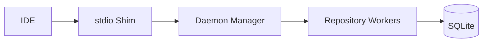

# Civyk Repo Index

[](https://www.python.org/downloads/)
[](LICENSE)
[](https://modelcontextprotocol.io/)
[](https://pypi.org/project/civyk-repoix/)
[](https://sigstore.dev/)
[](https://slsa.dev)

**Semantic code intelligence for AI coding agents** — Give your AI assistant deep understanding of your codebase through the Model Context Protocol (MCP).

> **If you find this useful, please consider [supporting the project](#support)!**

[](https://www.youtube.com/watch?v=B4aq3cj_Pq8)

**Watch:** [What is Civyk Repo Index, why use it, and how to set it up](https://www.youtube.com/watch?v=B4aq3cj_Pq8)

______________________________________________________________________

## Local-First, Private, Secure

**Your code never leaves your machine.** Civyk Repo Index is a fully local MCP server:

- **100% offline** — No cloud services, no API calls, no telemetry
- **Your data stays yours** — All indexes and caches stored locally in SQLite
- **Works air-gapped** — Perfect for proprietary codebases and enterprise environments
- **Free binaries** — Compiled binaries available via PyPI at no cost

______________________________________________________________________

## Why Civyk Repo Index?

AI coding assistants have **limited context windows**. They can't read entire codebases. Civyk Repo Index provides **token-budgeted semantic code intelligence**:

- **Symbol-aware search** — Find functions, classes, and types instantly
- **Smart context packs** — Auto-select relevant code within token budgets
- **Relationship tracking** — Understand calls, imports, and inheritance
- **Real-time indexing** — Always up-to-date with your code changes
- **Multi-language** — Python, TypeScript, JavaScript, Java, Go, C#, Rust, Ruby, PHP
- **Branch-aware** — Separate indexes per git branch
- **AI Context Cache** — Persist code understanding across sessions, save 80-90% tokens

______________________________________________________________________

## Quick Start

### Installation

```bash
pip install civyk-repoix
```

### Setup for Your AI Agent

```bash
cd /path/to/your/project

# Interactive init (recommended)
civyk-repoix init

# Or configure specific agent
civyk-repoix init --ai claude        # Claude Code
civyk-repoix init --ai cursor-agent  # Cursor
civyk-repoix init --ai windsurf      # Windsurf
civyk-repoix init --ai copilot       # GitHub Copilot
civyk-repoix init --ai opencode      # OpenCode
civyk-repoix init --ai kilocode      # Kilo Code
civyk-repoix init --ai antigravity   # Antigravity

# Configure all supported agents at once
civyk-repoix init --all
```

### Verify

```bash
civyk-repoix query index-status
```

______________________________________________________________________

## MCP Tools

42 tools for code intelligence.

| Category | Tools |
|----------|-------|
| **Core** | `index_status`, `build_context_pack`, `search_symbols`, `get_symbol`, `get_references`, `get_components`, `get_api_endpoints`, `get_dependencies`, `force_reindex` |
| **Navigation** | `get_file_symbols`, `get_definition`, `get_callers` |
| **Discovery** | `list_files`, `get_file_imports`, `search_code` |
| **Git** | `get_recent_changes`, `get_hotspots`, `get_branch_diff` |
| **Analysis** | `get_dead_code`, `find_circular_dependencies`, `analyze_impact`, `get_tests_for`, `get_code_for_test`, `get_duplicate_code`, `get_tool_performance_stats` |
| **Advanced** | `get_type_hierarchy`, `get_related_files`, `find_similar` |
| **AI Cache** | `store_understanding`, `recall_understanding`, `get_understanding_stats`, `invalidate_understanding` |
| **Context** | `build_delta_context_pack`, `map_trace_to_symbols`, `get_recommended_tests`, `build_doc_pack` |
| **Conversation** | `list_conversation_sessions`, `get_conversation_history`, `build_conversation_context`, `log_conversation_turn`, `finalize_conversation_session`, `search_conversations` |

> **Tip:** Use `recall_understanding` before reading files — cached analysis saves 80-90% of tokens.

______________________________________________________________________

## AI Context Cache — Your AI Remembers

**The killer feature: Your AI assistant remembers what it learned about your code.**

Traditional AI coding assistants forget everything when you start a new chat or session. With Civyk Repo Index's AI Context Cache, understanding persists:

```text
Monday:    AI reads auth.py → analyzes → stores understanding
Tuesday:   New chat → AI recalls cached understanding → no file read needed!
Wednesday: You modify auth.py → cache auto-invalidates → AI re-analyzes
```

### Why This Matters

| Without Cache | With Cache |
|---------------|------------|
| AI re-reads files every session | AI recalls previous analysis instantly |
| Wastes tokens on repeated reads | **80-90% token savings** |
| Slow context building | Sub-millisecond recall |
| Understanding lost on chat restart | **Persists across sessions and chats** |

### How It Works

1. **First encounter**: AI reads a file, analyzes it, calls `store_understanding`
1. **Future sessions**: AI calls `recall_understanding` first — gets cached analysis
1. **File changes**: Cache auto-invalidates via content hash — AI re-analyzes
1. **Per-repository**: Each repo has its own persistent cache

### Cache Tools

| Tool | Purpose |
|------|---------|
| `recall_understanding` | **Call FIRST** before reading any file — retrieves cached analysis |
| `store_understanding` | Persist AI's analyzed understanding after reading files |
| `get_understanding_stats` | **Session start**: List cached targets, filter by path/scope, sort, check freshness |
| `invalidate_understanding` | Manually clear cached entries when needed |

`store_understanding` supports structured fields (purpose, key_points, gotchas) plus a free-form `analysis` field for complex business logic, state machines, and workflows.

> **Pro tip**: The AI Context Cache is stored locally in SQLite alongside your code index. Your analysis never leaves your machine.

______________________________________________________________________

## Conversation History — Context Across Sessions

**Your AI assistant remembers conversation context across sessions and compactions.**

When Claude Code or other AI agents hit context limits, they compact conversations — losing valuable context. With Civyk Repo Index's Conversation History, your discussions persist:

```text
Session 1:  AI discusses auth refactor → conversation logged
[Compaction happens]
Session 2:  AI calls build_conversation_context → restores key decisions and goals
```

### Conversation Tools

| Tool | Purpose |
|------|---------|
| `list_conversation_sessions` | Find recent sessions to restore context |
| `get_conversation_history` | Retrieve turns from a specific session |
| `build_conversation_context` | Build token-budgeted context from session history |
| `search_conversations` | Full-text search across all past conversations |

> **Hook Integration**: Conversation logging integrates with Claude Code hooks to automatically capture prompts and tool usage.

______________________________________________________________________

## AI Cache Hooks — Deterministic Cache Behavior

**AI agents don't need explicit instructions — hooks enforce cache operations automatically.**

Traditional approaches rely on AI following documentation, which is unreliable. Civyk Repo Index hooks ensure deterministic behavior:

```text
┌─────────────────────────────────────────────────────────────────┐
│ SessionStart Hook                                               │
│   → Loads cache stats, shows available entries                  │
├─────────────────────────────────────────────────────────────────┤
│ PreToolUse:Read Hook                                            │
│   → Checks cache BEFORE file read                               │
│   → Injects cached understanding if available                   │
├─────────────────────────────────────────────────────────────────┤
│ PostToolUse:Read Hook                                           │
│   → Reminds AI to store_understanding after analysis            │
├─────────────────────────────────────────────────────────────────┤
│ Stop Hook                                                       │
│   → Persists unsaved learnings before session ends              │
└─────────────────────────────────────────────────────────────────┘
```

### Supported Agents

| Agent | MCP | Hooks | Config Location |
|-------|-----|-------|-----------------|
| Claude Code | Yes | Yes | `.claude/settings.json` |
| Cursor | Yes | Yes | `.cursor/hooks.json` |
| Windsurf | Yes | Yes | `.windsurf/hooks.json` |
| GitHub Copilot | Yes | Yes | `.github/hooks/` |

### Setup

Hooks are configured automatically during setup:

```bash
civyk-repoix init              # Configures MCP + hooks
civyk-repoix init --no-hooks   # Skip hook configuration
```

> **No prompt engineering required**: Hooks inject cache context and reminders programmatically, so AI agents use the cache without explicit instructions.

______________________________________________________________________

## Language Support

| Tier | Languages |
|------|-----------|
| **Full** | Python, TypeScript, JavaScript |
| **Standard** | Java, Go, C#, Rust, Ruby, PHP |
| **SQL** | T-SQL, PL/SQL, Standard SQL |
| **Docs** | Markdown |

______________________________________________________________________

## Architecture

Daemon-based architecture for multi-repository support with **dual interface** — MCP protocol for AI agents or CLI for direct use.



**Key Components:**

- **Daemon Manager** — Coordinates worker lifecycle
- **Repository Worker** — One per repo, handles indexing and queries
- **Indexer** — Tree-sitter parsing, symbol extraction
- **Context Builder** — Token-budgeted context generation
- **Conversation Manager** — Session tracking and history persistence

### Dual Interface

| Mode | Usage | Interface |
|------|-------|-----------|
| **MCP** | AI agents (Claude, Cursor, etc.) | JSON-RPC over stdio |
| **CLI** | Direct terminal use, scripts | `civyk-repoix query <tool>` |

Both interfaces use the same underlying daemon and tool implementations — identical functionality, different access methods.

______________________________________________________________________

## CLI Mode

Use tools directly without MCP protocol:

```bash
civyk-repoix query search-symbols --query "%User%" --kind class
civyk-repoix query build-context-pack --task "implement auth" --token-budget 1000
civyk-repoix query list-conversation-sessions --days 7  # View recent sessions
civyk-repoix query --schema  # Get JSON schema of all tools
```

**Tool Name Mapping:** MCP uses `snake_case` (e.g., `search_symbols`), CLI uses `kebab-case` (e.g., `search-symbols`).

______________________________________________________________________

## Configuration

Location: `~/.config/civyk-repoix/config.yaml`

```yaml
index:
  max_file_size_mb: 10
  debounce_ms: 500

daemon:
  max_workers: 10
  idle_worker_timeout_s: 3600

context:
  default_token_budget: 800
  max_token_budget: 4000
```

**Environment Variables:**

| Variable | Default | Description |
|----------|---------|-------------|
| `CIVYK_LOG_LEVEL` | INFO | Log level |
| `REPOIX_PARSE_WORKERS` | CPU count | Parallel parsing workers |
| `REPOIX_CACHE_TTL` | 60 | Query cache TTL (seconds) |

______________________________________________________________________

## Performance

Benchmarked on Windows 11 Pro, Python 3.13, AMD Ryzen processor with a codebase of **152 files** and **6,443 symbols**.

### Tool Performance

| Tool | Avg Latency | Throughput | Category |
|------|-------------|------------|----------|
| `index_status` | 0.5ms | 3,700+ req/s | Fast |
| `get_symbol` | 0.6ms | 3,600+ req/s | Fast |
| `get_definition` | 0.6ms | 3,400+ req/s | Fast |
| `list_files` | 0.7ms | 3,100+ req/s | Fast |
| `get_file_symbols` | 0.8ms | 2,800+ req/s | Fast |
| `search_symbols` | 1.8ms | 600+ req/s | Medium |
| `get_callers` | 2.2ms | 500+ req/s | Medium |
| `get_references` | 2.5ms | 450+ req/s | Medium |
| `search_code` | 4ms | 280+ req/s | Medium |
| `get_components` | 2ms | 550+ req/s | Medium |
| `build_context_pack` | 16ms | 60+ req/s | Compute |
| `analyze_impact` | 35ms | 30+ req/s | Compute |
| `get_dead_code` | 45ms | 25+ req/s | Compute |
| `find_similar` | 90ms | 12+ req/s | Compute |

### Index Performance

| Operation | Performance |
|-----------|-------------|
| Full index (152 files) | ~3 seconds |
| Delta index | < 500ms |
| Symbol search | < 2ms |
| Context pack build | < 20ms |

______________________________________________________________________

## Support

**Help keep this project alive and growing!**

If Civyk Repo Index has helped your development workflow, consider supporting its continued development. Your contribution helps with:

- Ongoing maintenance and bug fixes
- New feature development
- Infrastructure costs

**50% of all donations go directly to children's charities** helping those in need. The remaining funds support project maintenance and feature upgrades.

[](https://buymeacoffee.com/civyk)
[](https://ko-fi.com/civyk)

> Every contribution, no matter the size, makes a difference.

______________________________________________________________________

## Security

All releases are cryptographically signed and include supply chain provenance.

### Verify Package Signatures

```bash
pip install sigstore
sigstore verify identity \
  --cert-oidc-issuer https://token.actions.githubusercontent.com \
  civyk_repoix-*.whl
```

### Security Features

- **Sigstore signing** on all releases
- **SLSA provenance** for supply chain security
- **OpenSSF Scorecard** for security best practices
- **100% local operation** - your code never leaves your machine

See [SECURITY.md](SECURITY.md) for our full security policy and vulnerability reporting.

______________________________________________________________________

## License

Proprietary — see [LICENSE](LICENSE)

**Free to use**: Compiled binaries are available via PyPI at no cost for personal and commercial use.
