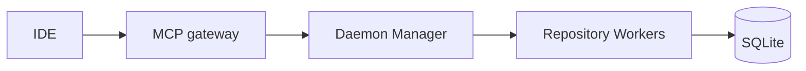

# Civyk Repo Index

[](https://www.python.org/downloads/)
[](LICENSE)
[](https://modelcontextprotocol.io/)
[](https://pypi.org/project/civyk-repoix/)
[](https://sigstore.dev/)
[](https://slsa.dev)

**Semantic code intelligence for AI coding agents** — Give your AI assistant deep understanding of your codebase through the Model Context Protocol (MCP).

> **If you find this useful, please consider [supporting the project](#support)!**

<p align="center">
  
</p>

[](https://www.youtube.com/watch?v=B4aq3cj_Pq8)

**Watch:** [What is Civyk Repo Index, why use it, and how to set it up](https://www.youtube.com/watch?v=B4aq3cj_Pq8)

______________________________________________________________________

## Local-First, Private, Secure

**Local by default.** Indexing, search, context packs and the MCP tools run entirely on your machine:

- **Offline by default** — No cloud services, no API calls, no telemetry unless you opt in
- **Your data stays yours** — All indexes and caches stored locally in SQLite
- **Works air-gapped** — Perfect for proprietary codebases and enterprise environments
- **Cloud features are explicit opt-ins** — Deep-wiki generation/Q&A uses the LLM you configure (`CIVYK_LLM_API_KEY` or GitHub Copilot) and sends wiki prose plus the code context it grounds on. The Jev decision model is on by default for a few interactive features but makes no call until you set `CIVYK_REPOIX_JEV_API_KEY`; by default it sends index metadata (names, kinds, paths, docstrings, wiki prose without code) and your query, never source, which needs `jev.allow_source_upload: true` ([details](#jev-decision-model)). Nothing is sent while these keys are unset.
- **Free binaries** — Compiled binaries available via PyPI at no cost

______________________________________________________________________

## Why Civyk Repo Index?

AI coding assistants have **limited context windows**. They can't read entire codebases. Civyk Repo Index provides **token-budgeted semantic code intelligence**:

- **Symbol-aware search** — Find functions, classes, and types instantly
- **Smart context packs** — Auto-select relevant code within token budgets
- **Relationship tracking** — Understand calls, imports, and inheritance
- **Real-time indexing** — Always up-to-date with your code changes
- **Multi-language** — Python, TypeScript, JavaScript, Java, Go, C#, Rust, Ruby, PHP
- **Hybrid retrieval** — Exact, lexical, file and semantic rankings fused for questions about the code
- **Semantic Search** — Vector embedding-based symbol search

______________________________________________________________________

## Quick Start

### Installation

PyPI ships compiled wheels only, for CPython 3.10, 3.11, 3.12 and 3.13 on Linux x86_64,
Windows AMD64 and macOS arm64. There is no wheel for Python 3.14 yet, so install into a 3.10 to
3.13 interpreter.

All extras are optional — the base install is fully functional on its own. Pick the combination for the capabilities you want:

```bash
# 1) Base — indexing, symbol/semantic search, MCP tools.
#    Semantic search uses a lightweight lexical fallback (TF-IDF); no LLM features.
pip install civyk-repoix

# 2) With embeddings — local vector semantic search (sentence-transformers, offline, free)
pip install "civyk-repoix[embeddings]"

# 3) With LLM — deep-wiki generation & Q&A via an OpenAI-compatible API (OpenAI, Minimax, …).
#    (GitHub Copilot needs no extra — it uses your editor's Copilot sign-in, no SDK.)
pip install "civyk-repoix[llm]"

# 4) With both (recommended for deep-wiki) — semantic retrieval + LLM generation
pip install "civyk-repoix[embeddings,llm]"   # or the shorthand: civyk-repoix[all]
```

| Install | Adds | Enables |
|---------|------|---------|
| `civyk-repoix` | — | Indexing, symbol search, TF-IDF semantic search, all MCP tools |
| `civyk-repoix[embeddings]` | sentence-transformers, numpy | Local **vector** semantic search + wiki RAG retrieval |
| `civyk-repoix[llm]` | openai | **Deep-wiki** generation + `ask` via OpenAI-compatible APIs |
| `civyk-repoix[all]` | both of the above | Full feature set — best deep-wiki quality (RAG + LLM) |

> **Deep-wiki is opt-in.** After installing `[llm]` (or configuring GitHub Copilot), enable it with `wiki.enabled: true` and a `generation` provider. See [Deep Wiki](#deep-wiki--auto-generated-docs-your-agent-can-query).

### Setup for Your AI Agent

```bash
cd /path/to/your/project

# Interactive init (recommended)
civyk-repoix init

# Or configure specific agents (--agent is accepted as an alias of --ai)
civyk-repoix init --ai claude        # Claude Code
civyk-repoix init --ai cursor-agent  # Cursor
civyk-repoix init --ai windsurf      # Windsurf
civyk-repoix init --ai copilot       # GitHub Copilot
civyk-repoix init --ai opencode      # OpenCode
civyk-repoix init --ai kilocode      # Kilo Code
civyk-repoix init --ai antigravity   # Antigravity

# Configure all supported agents at once
civyk-repoix init --all
```

### Verify

```bash
civyk-repoix query status --action check   # index state, and whether Jev is active and why not
civyk-repoix status                        # worker, daemon, embedding model, log directory
```

### Upgrading to 3.1.0

1. **The first open of each index rewrites its file** (schema 3.1.0: float16 embeddings, no stored
   chunks for JSON files over 32 KiB, 16 KiB pages). It takes seconds to minutes depending on the
   size of the index and needs free disk equal to that size (twice that when the system's
   temporary directory is on the same disk). If the file is busy or the disk is short, the index
   stays as it was, `daemon.log` says why, and the next start tries again.
2. **A migrated index cannot go back to 3.0.0**: a 3.0.0 build would misread its vectors. To
   downgrade, delete the index and rebuild it, as described under the 3.0.0 upgrade below.
3. Every code file is parsed again once, because the extractors changed. Re-run
   `civyk-repoix init` (or `civyk-repoix skill install`) so the skills match the new version.

The full list is in the [CHANGELOG](CHANGELOG.md).

### Upgrading to 3.0.0

Three changes need action. The full list is in the [CHANGELOG](CHANGELOG.md).

1. **The Jev settings are renamed, and the old names are not read.** The config section
   `decision` is now `jev`, its keys have new names, and the `CIVYK_DECISION_*` environment
   variables are now `CIVYK_REPOIX_JEV_*`. An old section, key or variable is ignored, so its
   value no longer applies. The rename table is in the CHANGELOG. A one-time script in the
   source repository (it is not part of the package) migrates the config files and, on Windows,
   the user environment variables:

   ```bash
   cd scripts/migrations/2026-10-02-jev-rename
   python migrate_jev_rename.py --root <folder holding your repositories>          # dry run
   python migrate_jev_rename.py --root <folder holding your repositories> --apply  # write, with backups
   ```

   It also rewrites the global config, and reports (never edits) other files that still use
   the old names, such as `.mcp.json` or `.env` files. On Linux and macOS it only reports the
   old environment variables; rename them yourself. Its README describes the options, the
   backups and the rollback.

   Jev was opt-in in 2.1.1. Now, once `CIVYK_REPOIX_JEV_API_KEY` is set, the features that make
   a few metadata-only calls run by default: the `search` and `explore` reranks, the `wiki ask`
   chunk filter and the `wiki lint` pair flagging. Source upload and the bulk features stay off.
   See [Jev decision model](#jev-decision-model) to turn any of them off.

2. **Indexes migrate on first start.** An index written by 2.1.1 (schema 2.11.0) moves to
   schema 2.25.0 in one step; an older index runs its earlier steps first. Either is then
   re-parsed once, because the extractors changed. An index that a development build stamped
   with a schema version from 2.12.0 to 2.24.0 is not migrated: `daemon.log` says the build does
   not know that version. Check the version of an index with:

   ```bash
   python -c "import sqlite3; print(sqlite3.connect('memory/codebase-index/index.db').execute(\"SELECT value FROM schema_info WHERE key='version'\").fetchone()[0])"
   ```

   To rebuild such an index, run `civyk-repoix daemon stop`, delete
   `memory/codebase-index/index.db` (with `index.db-wal` and `index.db-shm` when present), then
   run `civyk-repoix rebuild`. Deleting it loses that repository's `remember` entries, the wiki
   rows of the index (the page files under `memory/deep-wiki/` stay) and the Jev answer cache
   and edge-decision ledger.

3. **`civyk_repoix.MCPServer` is removed.** Importing it fails with `AttributeError`. Run the MCP
   server with `civyk-repoix mcp`. The config sections `branches` and `context`, the profile
   tiers, `idle_daemon_timeout_s` and `startup_mode` are removed too; a config file that still
   holds them is read without them.

Re-run `civyk-repoix init` (or `civyk-repoix skill install`) after upgrading, so that the rules
block and the agent skills match the installed version.

______________________________________________________________________

## MCP Tools

<!-- registry:readme-tools -->
14 tools for code intelligence, 8 core and 6 extended. A tool with actions takes an `action` parameter that selects one.

| Tier | Tool | Actions | Purpose |
| --- | --- | --- | --- |
| **Core** | `status` | `check`, `reindex`, `perf_stats`, `report` | Check index health, trigger reindex, view tool performance stats, or regenerate the static repo report (memory/codebase-index/REPORT.md). |
| **Core** | `search` | `symbols`, `code`, `definition`, `semantic` | Search symbols, code text, find definitions, or search by meaning. |
| **Core** | `symbol` | `detail`, `references`, `callers`, `hierarchy`, `similar` | Get symbol details, references, callers, hierarchy, or similar. |
| **Core** | `file` | `symbols`, `imports`, `related` | Get symbols, imports, or related files for a path. |
| **Core** | `files` | -- | List indexed files with filtering. |
| **Core** | `git` | `changes`, `hotspots`, `diff` | Analyze recent changes, hotspots, or branch diffs. |
| **Core** | `explore` | -- | Start here: one call routed by the query (name, path, tests for X, question). |
| **Core** | `remember` | `store`, `recall`, `list`, `forget` | Persist project memories across sessions - store, recall, list, or forget. |
| **Extended** | `architecture` | `components`, `dependencies`, `endpoints` | View components, dependencies, or API endpoints. |
| **Extended** | `quality` | `dead_code`, `duplicates`, `circular_deps`, `impact` | Find dead code, duplicates, circular deps, or analyze impact. |
| **Extended** | `context` | `task`, `delta`, `docs`, `trace` | Build context packs for tasks, PRs, docs, or traces. |
| **Extended** | `tests` | `recommended`, `for_file`, `code_for_test` | Get recommended tests, tests for file, or code for test. |
| **Extended** | `wiki` | `ask`, `generate`, `status`, `list`, `read`, `export`, `lint`, `plan`, `page_context`, `save_page` | Deep-wiki: ask questions, generate/update, lint, or read the codebase wiki. |
| **Extended** | `config` | `list`, `get`, `set`, `reset` | Manage runtime config: list, get, set, or reset any config key. |
<!-- /registry:readme-tools -->

______________________________________________________________________

## Static Repo Report — One Read to Orient

Every index pass regenerates `memory/codebase-index/REPORT.md`: a pre-digested
structural overview (components and layering — with a directory-map fallback
when component detection covers too little of the repo, component
dependencies, likely entry points, most-referenced and highest fan-out
symbols, a test-suite overview, 30-day change hotspots) of at most 8 KB; when
the rows do not fit, it shows fewer and says so. Both ends of every counted reference must be production code — a test
calling a function is not evidence that the codebase depends on it — so the
rankings reflect the production surface. Any agent — in any client, with no MCP
setup — orients itself with a single file read instead of a grep sweep.

- **Graph confidence.** References resolve by name, so every edge records how it
  was resolved — `local` (same file), `import` (a module this file imports),
  `unique` (the only definition of that name, which the file reaches), `ambiguous`
  (a guess among equals), or `model` (an ambiguous edge that the Jev edge resolver re-bound;
  off by default). **Only evidence-backed edges (`local`, `import`, `unique`)
  rank**; the report states the mix, so a
  guess is never presented as a fact, and a report built on an unresolved graph
  says so instead of publishing a plausible-looking table.
- **`memory/codebase-index/graph.json`** ships beside the report: the same
  file-level dependency graph, machine-readable (nodes = production files with
  `path`, `language`, `symbols` and `component`; edges = weighted file→file
  references, one row per resolution, plus a `provenance` summary and a
  top-level `scope` stating what the graph covers) for programs. It is not for
  reading whole: an agent asks `file(action="related")` (a file's importers and
  imports, with a `resolution_mix`) or `architecture(action="dependencies")`,
  which answer from the same edges.
- Links between Markdown documents are indexed as `doc_link` edges:
  `file(action="related")` on a document lists `links_to` and `linked_from`. They
  never count as code references in the rankings, callers or impact.
- Refreshed automatically after full/delta index passes and watcher-indexed
  changes (atomic writes, coalesced and rate-limited under bursts).
- Regenerate on demand: `status(action="report")` (MCP), `civyk-repoix report`
  (CLI, `--print` to stdout), or the `/repoix-map` skill (see below).
- The header states generation time and index freshness so staleness is
  always visible.
- MCP hosts that read resources get the report as `repoix://report` and each wiki page as
  `repoix://wiki/<page id>`, listed by `resources/list`.

______________________________________________________________________

## Deep Wiki — Auto-Generated Docs Your Agent Can Query

**A Devin DeepWiki–style knowledge base for your repo — built either by your agent's own
session LLM via the `/repoix-wiki` skill (no API key needed) or by any OpenAI-compatible
model (OpenAI, Minimax, OpenRouter, local servers, …) — and queryable over MCP/CLI.**

> **Agent-session generation.** `/repoix-wiki` drives `wiki(action="plan")` →
> `page_context` → `save_page`: the tools own page identity (a **pinned plan of record** —
> ids never churn between builds), staleness, grounding, and storage; your agent writes and
> *surgically edits* the prose. Works without `wiki.enabled`, the `[llm]` extra, or any
> API credential. Wikis maintained this way are protected from automatic API-LLM rebuilds.
> After a large refactor, `/repoix-wiki --replan` lets the new structure replace the pinned
> plan; the prose carries forward.

The `wiki` tool builds a structured, navigable wiki grounded in your actual code via semantic
retrieval (RAG). Each page type has its **own aspect-specific sections** (overview, architecture,
getting-started, data models, API/endpoints, and module pages), plus **detector-gated pages** that
appear only when your repo has them: **Configuration, Dependencies, Errors & Exceptions, Key Flows,
and Examples**. Overview and architecture are synthesized **bottom-up** from per-module digests for
consistency. Each page carries **`[path:Lstart-Lend]` citations to real files**, relevance-gated
inline **Mermaid diagrams**, a human `README.md` landing page (navigation + per-page table) with a
0–100 **quality score**, and a machine-readable `manifest.json`. The **module page set is planned
structurally and deterministically** from the project units of the real source tree and pinned, so
page ids stay stable (`wiki.planning` defaults to `structural`; only an API-key `generate` opted
into `auto` or `llm` asks its LLM to group modules, and the agent path never does), while code guarantees ~100% coverage of the
**production surface** (every indexed source file except test code — tests *ground* pages via the
Examples page and each page's "tests covering this code" block, rather than being documented as
subsystems; set `wiki.include_tests: true` for a repo whose product is a test suite) and prunes
pages that leave the plan.

**Inline diagrams** (embedded in each page, **only when they add meaning** — trivial single-node or
edgeless graphs and short sequence diagrams are dropped):

- **Deterministic, from the symbol/edge graph** (no hallucination): component dependencies, a
  whole-system **data-flow** with upstream/downstream external systems (CLI, MCP client, LLM API,
  embeddings, SQLite, git, filesystem), per-module data-flow (providers → module → consumers), and
  class diagrams.
- **LLM-proposed, then validated** against the indexed symbols: **sequence diagrams** for key flows
  on the architecture and high-importance module pages.

Output is written under your repo at `memory/deep-wiki/<branch>/` (`pages/*.md`, `README.md`,
`manifest.json`, plus `business-context.json` and `digests.json` caches), branch-aware, primary
branch `main`/`master` (configurable). A grounded **business-context** pre-pass (product purpose,
domain entities, glossary) sharpens the overview/getting-started pages, and a compact glossary
**anchor** is fed to every page so terminology stays consistent. The page-synthesis prompt keeps an
identical system prefix across all pages so providers can serve it from their prompt-prefix cache.

- **Ask the wiki:** `wiki(action="ask", query="how does auth work", mode="answer")` — `rag`
  (sections + citations, no LLM cost), `answer` (LLM-synthesized), or `deep` (multi-step research).
- **Compounding research notes:** `wiki(action="ask", mode="deep", save=true)` files the answer as
  a durable **Research Notes** page (chunked + embedded), so future asks retrieve it instead of
  re-deriving the research. Notes survive rebuilds and surface as stale when their cited files
  change.
- **Owner steering:** an optional `memory/deep-wiki/steering.yaml` lets the repo owner add context
  notes, pin custom pages (`pages:` with path prefixes), emphasize topics per page or globally
  (`emphasis:`), and hide paths from the wiki (`exclude_paths:`). Steering changes automatically
  mark affected pages stale.
- **Wiki lint:** `wiki(action="lint")` runs cross-page health checks — broken/dead links, orphan
  pages, dead citations, stale pages/notes, dead/unverifiable notes, coverage gaps, deliberately
  excluded paths, duplicate titles, citations whose lines are not lines of their file or span more
  than 150 lines — plus an optional LLM contradiction/duplication pass (`wiki.lint_llm`). The free
  structural tier also runs after every changed build; a lint whose summary changed lands in the
  manifest (which keeps the commit, time and tokens of the build), and its high and medium
  findings take points off the README's score.
- **Append-only audit log:** every build, filed note, and lint pass appends one grep-able line to
  `memory/deep-wiki/<branch>/log.md` — the wiki's chronological history.
- **Architecture-aware planning:** one page per project unit (the nearest manifest root, so
  `packages/ports/src` is `ports`); a unit above `wiki.max_symbols_per_page` or
  `wiki.max_loc_per_page`, or holding a god file (`wiki.god_file_symbols`), splits into a
  digest-grounded parent and child pages: by filename family, then by community on the trusted
  edges (the same clustering as `graph.json`'s `communities`); sibling packages of one shape
  share a family page. Page importance (PageRank, entry points, churn, doc mentions) orders the
  pages, allocates `wiki.max_pages` and picks each page's grounding budget
  (`wiki.grounding_budget_high`, `_medium`, `_low`).
- **Intelligent (re)generation:** triggered by a **changed-file threshold** and/or a **schedule** —
  never on every save. **Opt-in** — deep-wiki is off by default; set `wiki.enabled: true` **and**
  configure a `generation` provider to turn it on. Incremental: only pages whose sources changed
  are rebuilt.
- **Graceful degradation:** with no LLM configured it still produces structural pages + deterministic
  diagrams, and `ask` returns retrieval-only results.

### Two ways to build the wiki

**1. Agent-written (default; no API key, no LLM config).** Run **`/repoix-wiki`** in your
agent. The session's own model writes the prose; the tools own page identity, staleness,
grounding, citation validation, and storage. Nothing in `generation` or `wiki.enabled` is
consulted — those gate only the API-LLM path below. Skills are a cross-agent standard, so
this works in Claude Code, Cursor, Windsurf, and Copilot alike.

```bash
pip install "civyk-repoix[embeddings]"   # semantic retrieval; no llm extra needed
civyk-repoix init                        # installs the skills
civyk-repoix rebuild
# then, in Claude Code:  /repoix-wiki
```

**2. API-LLM (headless).** Needed when no agent is in the loop — CI/scheduled builds and
the `ask` answer/deep modes. Point `generation` at a chat model and opt the wiki in:

```bash
# 1. Install with semantic embeddings (sentence-transformers) + the OpenAI SDK
pip install "civyk-repoix[embeddings,llm]"

# 2. Provide the LLM key via env ONLY (never commit it)
export CIVYK_LLM_API_KEY=...

# 3. Initialize the repo (creates memory/codebase-index/config.yaml) and index it
civyk-repoix init
civyk-repoix rebuild                          # builds the semantic index

# 4. In memory/codebase-index/config.yaml set:
#      daemon.embedding_backend: auto          # -> local sentence-transformers when installed
#      generation.provider: minimax            # REQUIRED: any value other than the default
#                                              # `copilot` selects the OpenAI-compatible client
#      generation.base_url: https://api.minimax.io/v1
#      generation.model: MiniMax-M3            # any model that endpoint serves
#      wiki.enabled: true                      # gates the API-LLM/auto path only
#    (`provider` SELECTS the client. While it is `copilot` — the default — base_url and
#     CIVYK_LLM_API_KEY are ignored and every call goes to GitHub Copilot. An LLM counts
#     as configured once a provider+model resolve with a credential — there is no separate
#     generation.enabled switch)
civyk-repoix query wiki --action generate
civyk-repoix query wiki --action ask --query "how does indexing work" --mode answer
```

Once a wiki is agent-written, automatic API-LLM rebuilds skip it (they would overwrite the
agent's prose); an explicit `wiki(action="generate")` hands it back to the API path.

**Why the embeddings extra matters:** without it the embedding backend falls back to **tf-idf**
(keyword-only), which weakens `ask` retrieval. With `sentence-transformers` installed,
`embedding_backend: auto` uses a local semantic model (`all-MiniLM-L6-v2`, offline, free) so `ask`
retrieves by meaning. The model loads in the background, so the daemon answers at once after it
starts: until the model is loaded, `ask` and semantic search reply that it is still loading, and
`civyk-repoix status` shows how long it has been. A model that cannot be loaded is tried again,
never replaced by tf-idf; set `embedding_backend: tfidf` to ask for tf-idf. `ask` answers are
grounded in both the wiki prose **and** real code
symbols/snippets pulled from the index (`wiki.code_context_token_budget`), with every citation
validated against the index.

> Already wired to DeepWiki's MCP? `read_wiki_structure`, `read_wiki_contents`, and
> `ask_question` are exposed as drop-in aliases.

### Choosing a model

Deep-wiki generation is grounded synthesis + Q&A — a capable instruction-following model with good
code comprehension and a large context window is the sweet spot. **GitHub Copilot with
`claude-opus-4.8` is the default** (see below, no API key); the table below lists OpenAI-compatible
alternatives if you'd rather use an API key. Reasoning models (e.g. MiniMax-M2.x/M3) emit a
`<think>…</think>` block that
the client strips automatically, so output stays clean; `generation.max_output_tokens` defaults to
16000 to leave headroom for the reasoning pass. Set `provider`/`base_url`/`model` in `config.yaml`
(or via the `CIVYK_LLM_*` env vars); the API key always comes from `CIVYK_LLM_API_KEY`.

| Provider | Recommended (balanced) | `base_url` | Cheaper ↓ / Stronger ↑ |
|----------|------------------------|------------|------------------------|
| **MiniMax** | `MiniMax-M3` | `https://api.minimax.io/v1` | ↑ `MiniMax-M2` (reasoning) |
| **Z.AI (GLM)** | `glm-4.6` | `https://api.z.ai/api/paas/v4` | ↓ `glm-4.5-air` |
| **OpenAI** | `gpt-5-mini` | `https://api.openai.com/v1` | ↓ `gpt-4.1-mini` / ↑ `gpt-5` |
| **Anthropic** | `claude-sonnet-4-6` | `https://api.anthropic.com/v1` | ↓ `claude-haiku-4-5` / ↑ `claude-opus-4-8` |

```bash
# Switch provider by overriding four values (key always via env). CIVYK_LLM_PROVIDER is
# REQUIRED: it selects the client, and while it stays `copilot` (the default) the base_url
# and the API key below are ignored and the calls still go to GitHub Copilot.
export CIVYK_LLM_PROVIDER=openai   # any value but `copilot` => the OpenAI-compatible client
export CIVYK_LLM_BASE_URL=https://api.z.ai/api/paas/v4
export CIVYK_LLM_MODEL=glm-4.6
export CIVYK_LLM_API_KEY=...
```

> **Note (Anthropic):** the wiki client sends `temperature`. `claude-sonnet-4-6` accepts it; the
> Opus 4.7/4.8 and Fable reasoning models reject sampling params over the API — prefer Sonnet for the
> OpenAI-compatible path. Provider model names/pricing change often — verify on the provider's docs.

### Use your GitHub Copilot subscription (the default)

GitHub Copilot is the **default** LLM provider (`generation.provider: copilot`,
`generation.model: claude-opus-4.8`), so it drives the **entire** deep-wiki pipeline (generation
**and** `ask`) with no paid API key. The built-in adapter performs the GitHub→Copilot token
exchange + refresh and sends the editor headers in-process (no separate proxy to run):

```bash
# 1. Authorize once — SKIP this if you're already signed in to Copilot in VS Code / Neovim
#    (the adapter reuses the editor's token from ~/.config/github-copilot automatically).
civyk-repoix copilot login

# 2. See which models your plan exposes (claude-*, gemini-*, gpt-5.*, …)
civyk-repoix copilot models

# 3. Generation already defaults to provider=copilot, model=claude-opus-4.8 — best deep-wiki
#    quality in our tests. Prefer speed? Pick the fast model in memory/codebase-index/config.yaml:
#      generation.model: claude-haiku-4.5    # ~6× faster, slightly shallower
#   (any id from `copilot models`; premium models like Opus require them enabled on your plan)

civyk-repoix copilot status              # verify the credential + configured model
```

> **Heads-up — the default `claude-opus-4.8` is a *premium* Copilot model.** It needs an entitled
> plan with available premium-request quota; if your plan lacks it (or the quota is exhausted),
> Copilot returns `model_not_supported` and the wiki degrades to structural (LLM-free) pages. For an
> **always-available, fast** alternative set `generation.model: claude-haiku-4.5` (≈6× faster builds,
> no premium quota, zero stubs in our tests) — or any non-premium id from `civyk-repoix copilot models`.

The GitHub credential is resolved (in priority) from `CIVYK_COPILOT_GITHUB_TOKEN` → a cached
`copilot login` → the editor's `~/.config/github-copilot/{apps,hosts}.json`; it is never written to
`config.yaml`, and the short-lived Copilot token is refreshed automatically so long builds keep
working. (A self-hosted external Copilot proxy also still works the normal way:
`provider=openai` + `base_url=<proxy>`.)

**Output length / streaming.** Responses are **streamed** by default (`generation.stream: true`,
all providers). This matters for Copilot: its non-streaming responses are capped at **16k output
tokens** per model (`max_non_streaming_output_tokens`) and a request that hits that cap comes back
empty — streaming lifts the ceiling to the model's full output limit (e.g. 64k for Claude Sonnet
4.6), so large pages generate completely. Tune `generation.max_output_tokens` to how long pages
should run and keep `generation.timeout_s` comfortably above the time to generate that many tokens
(it bounds total wall-clock per streamed call). Copilot also throttles concurrent requests per
token, so a low `wiki.concurrency` (≈2) builds most reliably. Set
`generation.stream: false` only for an endpoint that doesn't support SSE.

______________________________________________________________________

## Agent Setup

`civyk-repoix init` gives each agent three things: an MCP server entry so the tools are
callable, a rules file so the agent knows they exist, and the agent skills.

| Agent | MCP config | Rules file | Skills read from |
|-------|-----------|------------|------------------|
| Claude Code | `.mcp.json` | `.claude/rules/civyk-repoix.md` | `.claude/skills/` |
| Cursor | `.cursor/mcp.json` | `.cursor/rules/civyk-repoix.mdc` | `.cursor/skills/`, `.claude/skills/` |
| Windsurf | `.windsurf/mcp.json` | `.windsurf/rules/civyk-repoix.md` | `.windsurf/skills/` |
| GitHub Copilot | `.vscode/mcp.json` | `.github/copilot-instructions.md` | `.github/skills/`, `.claude/skills/` |

The rules file is written in whatever form the agent actually loads: Cursor ignores a
`.cursor/rules` file that carries no frontmatter (hence `.mdc` with `alwaysApply: true`),
and a Windsurf rule needs an explicit `trigger` to be always-on.

The civyk block inside that file is *managed*: re-running `init` refreshes it in place
(so an upgraded repo stops advertising tools a release removed) and leaves everything you
wrote around it untouched. It is deliberately short — it is injected into every session,
where it competes with your own instructions. The full playbook lives in the `repoix`
skill, which the agent loads only when a discovery-shaped task actually appears.

Agent skills are a cross-agent standard, so `init` installs them for every configured
agent whose skills directory is documented (the four above) — not just Claude. An agent
with no published skills directory gets the MCP server and the rules file, and `init`
says which agents it skipped rather than guessing at a path.

Because several agents read each other's directories, the skills are installed into the
directories that cover each configured agent **exactly once** — never twice: configure
Claude and Cursor together and both are served from `.claude/skills` alone; configure
Cursor alone and the skills land in `.cursor/skills` (its own directory, not a `.claude/`
one that belongs to an agent you don't use). `init` prints the resulting directory → agent
map. (Real files, not symlinks: Cursor won't follow a link out of its own tree, VS Code
rejects a linked skills directory, and git cannot commit a junction.)

```bash
civyk-repoix init              # MCP + rules file + skills + permission allow
civyk-repoix init --no-skill   # skip the project-scope agent skills
```

> **Upgrading from 1.x?** The hooks subsystem is gone. `init` strips the stale hook
> entries from your agent config, and any hook that fires before you re-run `init`
> removes them itself — so nothing breaks either way. Your own hooks are left alone.

### Making Agents Actually Use the Index — Report, Skills, Permissions

Static instructions decay over long sessions, so agents drift back to grep and re-discover
the same code every session. Three layers counter that:

1. **The static report** (`memory/codebase-index/REPORT.md`) — orientation via a plain
   file Read, the one interface every agent already prefers. No tool-selection decision
   for the model to get wrong.

2. **Three embedded skills**, surfaced at decision time rather than injected up front:
   `repoix`, a playbook (report-first defaults, task→tool routing, CLI fallback,
   freshness rules) the agent loads when a discovery-shaped task appears; `repoix-map`
   (`/repoix-map`), a user-invoked orientation flow that indexes if needed, refreshes the
   report, and summarizes it; and `repoix-wiki` (`/repoix-wiki`), which builds the deep
   wiki with the current session's model — no API key. All three are embedded in the
   executable and installed together:

   ```bash
   civyk-repoix skill install                          # user scope, Claude (~/.claude/skills)
   civyk-repoix skill install --agent cursor-agent     # user scope, Cursor (~/.cursor/skills)
   civyk-repoix skill install --scope project          # this project only (also done by init)
   civyk-repoix skill status --agent claude,windsurf   # installed versions per scope & skill
   ```

   `--agent` accepts a comma-separated list (repeatable) and defaults to `claude`; the
   directories are resolved the same way `init` resolves them. Installs are
   version-stamped — re-running after an upgrade refreshes the skills. `skill status` and
   `init` warn when a user-scope copy shadows this project's, which Claude Code allows it to
   do, and name the command that updates it. While an installed copy is older than the server,
   the MCP `instructions` and `status(action="check")` say what it gets wrong.

3. **Zero permission friction** — setup pre-allows the `mcp__civyk-repoix` server in the
   project settings, so a semantic call never costs a prompt that a plain grep doesn't.

______________________________________________________________________

## Language Support

| Tier | Languages |
|------|-----------|
| **Full** | Python, TypeScript, JavaScript |
| **Standard** | Java, Go, C#, Rust, Ruby, PHP |
| **SQL** | T-SQL, PL/SQL, Standard SQL |
| **Docs** | Markdown |

______________________________________________________________________

## Architecture

Daemon-based architecture for multi-repository support with **dual interface** — MCP protocol for AI agents or CLI for direct use.


```mermaid
graph LR
    IDE[IDE] --> Gateway[MCP gateway] --> Daemon[Daemon Manager] --> Workers[Repository Workers] --> DB[(SQLite)]
```

**Key Components:**

- **MCP gateway** (`civyk-repoix mcp`) — One process per host session. It answers `initialize` and `tools/list` itself, starts the daemon when needed, chooses the repository per call, and reconnects after a daemon restart
- **Daemon Manager** — Coordinates worker lifecycle
- **Repository Worker** — One per repo, handles indexing and queries
- **Indexer** — Tree-sitter parsing, symbol extraction
- **Context Builder** — Token-budgeted context generation
- **Embedding Engine** — Vector embeddings from one of three backends (sentence-transformers, API, TF-IDF), chosen from the configuration and from what is installed; the model loads in the background
- **Tool Health Tracker** — Auto-disables failing tools, re-enables after cooldown

### When the daemon stops answering

The daemon logs to the log directory of the user, not to the repository:
`%LOCALAPPDATA%\civyk-repoix\logs` on Windows, `$XDG_STATE_HOME/civyk-repoix/logs`
(or `~/.local/state/civyk-repoix/logs`) on Linux and macOS.

| File | What it holds |
|------|---------------|
| `daemon.log` | Requests, indexing, worker starts and stops |
| `daemon-fault.log` | The traceback of every thread when a native fault ends the daemon, or when its event loop stalls |
| `mcp-<pid>.log` | One MCP gateway process: which repository it chose, and why a call failed (pruned only when its process has ended) |

A line `Stale state from dead daemon` in `daemon.log` means that the daemon before
this one ended without a shutdown; it says when that daemon was last seen alive, and
`daemon-fault.log` says where it ended. A line `The event loop has been stalled` gives
the stack of the loop, and the daemon exits if the stall lasts for `loop_stall_exit_s`, so
that a new one can start. One daemon serves every repository, so it restarts with
`civyk-repoix daemon stop`; the next query or MCP call starts a new one.

`civyk-repoix status` shows how busy the daemon's tool lane is (calls running, slow calls
waiting) and the state of the embedding model. A request the daemon cannot serve now, such
as a slow call when 16 already wait, is answered as busy, with a hint, and can be repeated.

### Dual Interface

| Mode | Usage | Interface |
|------|-------|-----------|
| **MCP** | AI agents (Claude, Cursor, etc.) | JSON-RPC over stdio |
| **CLI** | Direct terminal use, scripts | `civyk-repoix query <tool>` |

Both interfaces use the same underlying daemon and tool implementations — identical functionality, different access methods.

______________________________________________________________________

## CLI Mode

Use tools directly without MCP protocol:

```bash
civyk-repoix query search --action symbols --query "User" --kind class
civyk-repoix query context --action task --task "implement auth" --token-budget 1000
civyk-repoix query config --action list  # Show every setting and its effective value
civyk-repoix query --schema  # Get JSON schema of all tools
civyk-repoix skill install   # Install the agent skills (repoix, repoix-map, repoix-wiki)
```

**Tool Name Mapping:** Tool names are the same in both (`search`); MCP parameters are `snake_case` (`token_budget`), CLI flags `kebab-case` (`--token-budget`). Actions are passed via `--action`.

______________________________________________________________________

## Configuration

Location (per-repo, auto-created on first daemon run, **takes precedence**):
`<repo>/memory/codebase-index/config.yaml`. Falls back to the global default
`~/.config/civyk-repoix/config.yaml` (`$XDG_CONFIG_HOME/civyk-repoix/config.yaml` when that
variable is set); a missing per-repo file is created from the global one, or from the shipped
template. Edit the per-repo file to set `generation`/`wiki`/`jev`, or change settings without
touching files via `civyk-repoix query config --action set`.

The daemon serves every repository, so the keys it reads (all of `service` and most of
`daemon`) come from the **global** file only, and `config set` writes them there.
`civyk-repoix query config --action list` gives each key's `scope` (`global` or `per-repo`)
and its restart class. Environment variables override both files.

```yaml
index:
  max_file_size_mb: 10
  debounce_ms: 5000

daemon:
  max_workers: 10
  idle_worker_timeout_s: 3600
  embedding_backend: auto  # auto, local, api, tfidf, openai
  loop_stall_warn_s: 5  # log what the event loop is executing once it has stalled this long (0: no watchdog)
  loop_stall_exit_s: 180  # exit once it has stalled this long, so a fresh daemon can start (0: never)
  health_probe_timeout_s: 5  # how long a worker has to answer a health probe
  health_failures_before_restart: 3  # probes in a row nobody answers before a worker is restarted
  heartbeat_interval_s: 30  # how often the daemon records that it is alive (0 turns it off)

# Deep-wiki generation LLM. Defaults to GitHub Copilot (no API key — uses your
# editor's Copilot sign-in). For an OpenAI-compatible API instead, set provider +
# base_url and put the key in the CIVYK_LLM_API_KEY env var only — never in this file.
generation:
  provider: copilot                     # SELECTS the client: GitHub Copilot adapter, or "openai"/"minimax" for an API
  base_url: https://api.minimax.io/v1   # OpenAI-compatible endpoint (ignored when provider=copilot)
  model: claude-opus-4.8                # PREMIUM Copilot model; claude-haiku-4.5 = always-available + fast
  embedding_model: ""   # optional; enables the "openai" embedding backend

wiki:
  enabled: false              # opt-in: set true AND configure `generation` above to build the wiki
  branches: []                # empty => default branch (main/master) only
  default_branch_only: true   # lock ALL wiki gen to the default branch; ignores `branches` when on
  view: comprehensive         # comprehensive (8-12 pages) or concise (4-6)
  file_change_threshold: 25    # regenerate after N changed source files
  schedule_interval_s: 0       # 0 => disabled; else periodic build cadence (seconds)
  incremental_edits: true      # delta: reuse unchanged prose; minimal LLM edits when changed
  steering: true               # honor memory/deep-wiki/steering.yaml (owner notes/pages/emphasis/excludes)
  lint_llm: false              # wiki lint: also run the LLM contradiction/duplication pass
  max_symbols_per_page: 150    # split a unit into several pages above this many symbols
  max_loc_per_page: 5000       # ... or above this many lines
  god_file_symbols: 100        # a file above this many symbols gets a deep-dive page
  grounding_budget_high: 20000 # grounding tokens of a high-importance page
  grounding_budget_medium: 12000
  grounding_budget_low: 6000
  include_tests: false         # document test code as module pages (see below)
```

> **`incremental_edits` (on by default)** keeps delta rebuilds quiet. On a delta build, a page
> whose grounding (its code snippets + deterministic diagrams) is unchanged **reuses its prior
> prose** with no LLM call — so an unrelated edit elsewhere never reword-churns the page; a page
> whose grounding *did* change is **revised** (the model edits the prior page minimally) instead of
> rewritten from scratch. Citations are re-validated against the index either way. `force=true`
> always does a full re-synthesis. Set it to `false` to re-synthesize every stale page.
>
> **`default_branch_only` (on by default)** restricts every wiki build — delta/file-change,
> scheduled, and manual `wiki(action="generate")` (including `force=true`) — to the repo's
> default branch (main/master, git-detected). Auto-triggers on other branches are silently
> skipped; a manual `generate` on another branch is refused with a `skipped` status and a
> message. Set it to `false` to build on the branches listed in `branches` (or to force-build
> on any branch). Setting this key restarts the repo's worker so it takes effect immediately.

**Environment Variables:**

| Variable | Default | Description |
|----------|---------|-------------|
| `CIVYK_LOG_LEVEL` | INFO | Log level (`service.log_level`): `DEBUG`, `INFO`, `WARNING`, `ERROR` or `CRITICAL`, in any case |
| `CIVYK_LOG_CONSOLE` | 0 | `1` also writes the log to the console (development) |
| `CIVYK_MAX_FILE_SIZE_MB` | 10 | Files larger than this many megabytes are not indexed (`index.max_file_size_mb`) |
| `CIVYK_DEBOUNCE_MS` | 5000 | Milliseconds a saved file must stay unchanged before it is indexed again (`index.debounce_ms`) |
| `CIVYK_SYNTAX_RETRY_DELAY_S` | 5.0 | Seconds before a file that failed to parse is tried again (`index.syntax_retry_delay_s`) |
| `CIVYK_DELTA_CHECK_INTERVAL_S` | 300.0 | Seconds between the checks for changes the file watcher missed (`index.delta_check_interval_s`) |
| `CIVYK_HEALTH_DEGRADED_THRESHOLD` | 0.05 | Share of files that failed to index above which the index reports `degraded` |
| `CIVYK_HEALTH_UNHEALTHY_THRESHOLD` | 0.20 | Share of files that failed to index above which the index reports `unhealthy` |
| `REPOIX_PARSE_WORKERS` | half the cores, 2 to 8 | Worker processes that parse source files, so indexing never holds up the daemon's other work (at most 64; `0` parses inside the daemon) |
| `REPOIX_DB_READERS` | 6 | Read-only database connections that answer queries while a write is in progress (at most 32; `0` uses the single write connection) |
| `REPOIX_CACHE_TTL` | 60 | Query cache TTL (seconds) |
| `REPOIX_BATCH_SIZE_MIN` | 1 | Fewest files the indexer writes in one batch |
| `REPOIX_BATCH_SIZE_MAX` | 100 | Most files the indexer writes in one batch |
| `REPOIX_BATCH_SIZE_INITIAL` | by repository size, 5 to 50 | Files in the indexer's first batch, before it adapts the size |
| `REPOIX_PROGRESS_INTERVAL` | 50 | Files indexed between two progress reports |
| `REPOIX_DELTA_STREAMING_THRESHOLD` | 10 | An update of more files than this streams them to the indexer |
| `REPOIX_EMBED_THREADS` | 2 | Torch threads one local embedding call computes on (`0` leaves torch's own setting) |
| `REPOIX_SWITCH_INTERVAL_S` | 0.0005 | The daemon's thread switch interval in seconds, from 0.0001 to 0.005 (`0` leaves Python's own) |
| `REPOIX_IDLE_TIMEOUT` | 300.0 | Seconds a worker must be idle before it optimizes its database; overrides `daemon.background_optimization_idle_s` (0 or more) |
| `CIVYK_EMBEDDING_BACKEND` | auto | Embedding backend: `auto`, `local`, `api`, `tfidf`, `openai` |
| `CIVYK_LLM_API_KEY` | — | API key for the OpenAI-compatible LLM (deep wiki). Ignored when the provider is `copilot`. **Secret — env only** |
| `CIVYK_LLM_BASE_URL` | `https://api.minimax.io/v1` | Base URL of the OpenAI-compatible endpoint (e.g. Minimax). Ignored when the provider is `copilot` |
| `CIVYK_LLM_MODEL` | `claude-opus-4.8` | Chat model id used for wiki generation/Q&A |
| `CIVYK_LLM_PROVIDER` | copilot | **Selects the LLM client**, not a label: `copilot` uses the built-in adapter (and ignores `CIVYK_LLM_BASE_URL`/`CIVYK_LLM_API_KEY`); any other value (`openai`, `minimax`, …) uses the OpenAI-compatible client. Set it whenever you point at an API |
| `CIVYK_LLM_EMBEDDING_API_KEY` | — | Optional separate key for the `openai` embedding backend (falls back to `CIVYK_LLM_API_KEY`) |
| `CIVYK_LLM_EMBEDDING_MODEL` | — | Embedding model id for the `openai` backend |
| `CIVYK_COPILOT_GITHUB_TOKEN` | — | GitHub token for the `copilot` provider, in place of `civyk-repoix copilot login` or the editor's sign-in. **Secret — env only** |
| `CIVYK_WIKI_ENABLED` | false | Enable deep-wiki generation |
| `CIVYK_WIKI_FILE_CHANGE_THRESHOLD` | 25 | Changed source files before an auto-rebuild |
| `CIVYK_WIKI_STEERING` | true | Honor `memory/deep-wiki/steering.yaml` |
| `CIVYK_WIKI_LINT_LLM` | false | Wiki lint: run the LLM contradiction pass |
| `CIVYK_REPOIX_JEV_API_KEY` | — | API key of the Jev decision model (TypeSafe Jev through OpenRouter by default). Without it no Jev call is made. **Secret — env only**. On Windows a daemon whose environment lacks a `CIVYK_REPOIX_JEV_*` variable takes it from the persistent user environment (`HKCU\Environment`, what `setx` writes) |
| `CIVYK_REPOIX_NO_USER_ENVIRONMENT` | — | `1`: the daemon takes nothing from the persistent user environment (for a test or sandbox daemon started from a scrubbed environment on purpose). Read only from the daemon's own environment |
| `CIVYK_REPOIX_JEV_ENABLED` | true | `jev.enabled`: `0` turns every Jev feature off; on, Jev still needs `CIVYK_REPOIX_JEV_API_KEY`, and each feature has its own `jev.*` switch |
| `CIVYK_REPOIX_JEV_ENDPOINT_URL` | `https://openrouter.ai/api/alpha/decisions` | `jev.endpoint_url`: the decisions endpoint (OpenRouter), or TypeSafe direct `https://api.typesafe.ai/v1/systemone` |
| `CIVYK_REPOIX_JEV_MODEL` | typesafe/jev-1.13 | `jev.model`: the model id (`jev-latest` on the direct TypeSafe API) |
| `CIVYK_REPOIX_JEV_ALLOW_SOURCE_UPLOAD` | false | `jev.allow_source_upload`: consent to upload source code. `jev.index_resolve_edges` and `jev.wiki_check_citations` need it; `jev.quality_triage_dead_code` runs without it using index facts only and reads candidate files only with it |

______________________________________________________________________

### Jev decision model

A decision model is not a chat LLM: it answers typed questions (pick one option, score on a
rubric, true/false) with calibrated probabilities and generates no text. Civyk Repo Index uses
TypeSafe Jev (through OpenRouter by default) for narrow judgements the index cannot make
deterministically. Its settings are the `jev` section of the config file; each name says where the
setting acts (`search`, `explore`, `wiki ask`, `wiki lint`, `wiki check`, `quality`, `index`) and
what it does, and a number carries its unit (`_s`, `_usd`, `_days`). The section `decision` and
the `CIVYK_DECISION_*` variables of 2.1.1 are not read at all; see
[Upgrading to 3.0.0](#upgrading-to-300). Design, measurements and thresholds:
`docs/design/jev-decision-model-plan.md`.

**The rule:** the features that make a few calls and improve an interactive `search`, `explore` or
`wiki` answer are on by default. The bulk features, and every feature that uploads source code, are
off by default.

**The key and consent.** The API key is read only from the `CIVYK_REPOIX_JEV_API_KEY` environment
variable, never from a config file, and is never shown by any tool. On Windows, a daemon started
from an environment that lacks a `CIVYK_REPOIX_JEV_*` setting (an editor or a shell opened before
`setx`, for example) takes it at start from the persistent user environment
(`HKCU\Environment`); a value the daemon's own environment holds always wins, and the log names the
settings taken, never their values. Only the `CIVYK_REPOIX_JEV_*` settings are taken: the other
variables (`CIVYK_LLM_API_KEY` among them) reach the daemon only from the environment that starts
it. A daemon whose own environment sets `CIVYK_REPOIX_NO_USER_ENVIRONMENT=1` takes nothing (a test
or sandbox daemon started from a scrubbed environment). The `jev` block of `status(action="check")`
says where the key came from (`key`), and where each `CIVYK_REPOIX_JEV_*` setting an environment
variable gives came from (`environment`): such a value overrides the config files, so a consent
taken from the persistent user environment shows there. Without it no request is made
and no network is touched; the tools answer exactly as they do without Jev, with no warning or note
in their answers and nothing in the log on each call. A default install without the key therefore
makes no Jev calls. Three places say that Jev is inactive and why (no key, switched off, or no
endpoint): the `jev` block of `status(action="check")`; the `jev` field that the `config` tool adds
to `list` and to `get` of a `jev` key; and `wiki(action="lint")` with `wiki.lint_llm` on, once,
under `summary.decisions`. Uploading source code needs a second, separate consent:
`jev.allow_source_upload` (or `CIVYK_REPOIX_JEV_ALLOW_SOURCE_UPLOAD`), off by default. Every
question that would carry source asks this one consent. `status(action="check")` and the `config`
tool show it: `source_upload`, and with it `sends_source` (the switched-on features that send
source), without it `waits_for_consent` (the switched-on features that do nothing without it).

**What is sent by default is index metadata, never source:** symbol names, kinds and paths,
docstrings (documentation), wiki prose and page summaries with their fenced code blocks and inline
code replaced by `[code]`, and your query. Signatures and file contents are source and are sent
only with `jev.allow_source_upload`.

| Feature switch (`jev.*`) | Default | What it does | Calls | Needs source upload |
|---|---|---|---|---|
| `search_rerank_results` | **on** | `search(action="semantic")`: reorders the first 30 hits (name, kind, docstring and the query are sent); `note` says when nothing fits | one per search with code hits | no |
| `explore_rerank_results` | **on** | `explore`: reorders the first 12 hits of a question (name, kind, path, docstring and the question are sent); else the retriever's order | one per question | no |
| `wiki_ask_filter_chunks` | **on** | `wiki ask`: keeps the relevant retrieved wiki chunks, excludes prompt injection, notes when the wiki does not cover the question; in `rag` mode (and without an LLM) it only excludes prompt injection, and the agent judges relevance | one per ask in `answer` and `rag` mode; one per retrieval step in `deep` mode | no |
| `wiki_lint_flag_pairs` | **on** | `wiki lint`: the LLM contradiction pass sees only the page pairs Jev flags (page summaries are sent), or is skipped | one per lint that runs the LLM pass (`wiki.lint_llm`, off by default) | no |
| `allow_source_upload` | off | the consent to upload source code | — | it is the consent |
| `index_resolve_edges` | off | daemon pass after indexing: an `ambiguous` reference edge becomes a `model` edge or is deleted as external (the referencing symbol's source, its imports and the candidate definitions are sent) | up to `max_calls_per_batch` per pass | **yes**: does nothing without it |
| `wiki_check_citations` | off | wiki builds and lint: checks each cited sentence against its cited source lines; else the identifier check only | up to `wiki_check_citations_per_page` per page | **yes**: does nothing without it |
| `quality_triage_dead_code` | off | `quality(action="dead_code")`: labels each listed candidate `dead`, `used_dynamically` or `unsure`, dead first | one per listed candidate, all within one `tool_deadline_s` | no: without it only the candidate's index facts are sent; with it, also the candidate's file lines |

Every setting of the `jev` section:

| Setting (`jev.*`) | Default | What it does | What to set (examples) | Env var |
|---|---|---|---|---|
| `enabled` | `true` | Master switch. On, Jev still needs the key, and each feature has its own switch | `false` turns every feature off | `CIVYK_REPOIX_JEV_ENABLED` |
| `endpoint_url` | `https://openrouter.ai/api/alpha/decisions` | The decisions endpoint | `https://api.typesafe.ai/v1/systemone` for TypeSafe direct | `CIVYK_REPOIX_JEV_ENDPOINT_URL` |
| `model` | `typesafe/jev-1.13` | The model id | `jev-latest` on the direct TypeSafe API | `CIVYK_REPOIX_JEV_MODEL` |
| `allow_source_upload` | `false` | Consent to upload source code. `index_resolve_edges` and `wiki_check_citations` need it; `quality_triage_dead_code` runs without it using index facts only and reads candidate files only with it | `true` to let those features send source | `CIVYK_REPOIX_JEV_ALLOW_SOURCE_UPLOAD` |
| `search_rerank_results` | `true` | Feature switch (see the feature table) | `false` keeps the cosine order | — |
| `explore_rerank_results` | `true` | Feature switch | `false` keeps the retriever's order | — |
| `wiki_ask_filter_chunks` | `true` | Feature switch | `false` gives `wiki ask` every retrieved chunk | — |
| `wiki_lint_flag_pairs` | `true` | Feature switch | `false` runs the full LLM pass | — |
| `index_resolve_edges` | `false` | Feature switch (bulk, sends source) | `true`, with `allow_source_upload: true` | — |
| `wiki_check_citations` | `false` | Feature switch (bulk, sends source) | `true`, with `allow_source_upload: true` | — |
| `quality_triage_dead_code` | `false` | Feature switch | `true` | — |
| `tool_deadline_s` | `3.0` | Seconds a tool waits for its own Jev call (the reranks, the ask filter, the lint pairs), retries included; then it answers without Jev. The dead-code triage's calls of one page share this one deadline | `5` on a slow link | — |
| `daily_cost_cap_usd` | `1.0` | USD of paid calls per UTC day on one index; then only cached answers are served. Calls in flight hold their possible cost until they settle | `0.25`; `0` allows no paid call | — |
| `call_timeout_s` | `30.0` | Socket timeout of one attempt of a batch-pass call, in seconds | `60` | — |
| `max_retries_per_call` | `2` | Retries of a failed call | `0` for no retry | — |
| `max_parallel_calls` | `8` | Parallel calls in a batch pass (at least 1) | `4` | — |
| `max_calls_per_batch` | `500` | Completed calls in one batch pass (cache hits are free) | `100` | — |
| `max_input_tokens_per_batch` | `2000000` | Input tokens in one batch pass | `500000` | — |
| `refusal_pause_s` | `60.0` | Seconds the endpoint is left alone after it refuses (HTTP 401, 402, 403 or 520, or an HTML page); cached answers are still served | `120` | — |
| `refusal_pause_max_s` | `3600.0` | Each refusal in a row doubles the pause, up to this many seconds | `7200` | — |
| `price_usd_per_million_input_tokens` | `0.042` | Price used for a reply that reports no cost | your contract price | — |
| `wiki_ask_filter_min_relevance` | `0.45` | Ask filter: a chunk rated less relevant than this is dropped (0 to 1) | `0.6` drops more | — |
| `wiki_ask_filter_max_injection_score` | `0.7` | Ask filter: a chunk rated above this as instructions to the model is excluded (0 to 1) | `0.5` is stricter | — |
| `wiki_lint_flag_pairs_min_score` | `0.5` | Lint pairs: a pair whose contradiction or duplication rates at least this goes to the LLM pass (0 to 1) | `0.3` sends more pairs | — |
| `wiki_check_citations_per_page` | `20` | Cited sentences checked per page; the rest are not checked (at least 1) | `50` | — |
| `index_resolve_edges_min_confidence` | `0.8` | Edge resolver: a choice less confident than this leaves the guess as it is (0 to 1) | `0.9` changes fewer edges | — |
| `index_resolve_edges_max_injection_score` | `0.7` | Edge resolver: source text rated above this as instructing the model is not trusted (0 to 1) | `0.5` is stricter | — |
| `index_resolve_edges_max_candidates` | `30` | Edge resolver: definitions offered for one reference; a name with more is not asked (at least 2) | `50` | — |
| `index_resolve_edges_audit_days` | `30` | A resolver decision that a newer one superseded is pruned after this many days (at least 1) | `90` | — |
| `cache_retention_days` | `30` | Cached answers older than this many days are let go (the daemon prunes while idle); the spend ledger keeps their cost, and a question that comes back is paid for again (at least 1) | `90` | — |
| `cache_max_rows` | `5000` | Cached answers kept in the index; after each index pass the least recently used beyond this many are removed, and each is asked (and paid for) again the next time its question comes. The spend ledger keeps every cost | `20000` keeps more; `0` keeps every answer | — |

A number outside a setting's range is refused by `config set`, and a config file that holds one
gets the default instead, with a warning. An environment variable wins over the file.
`civyk-repoix query config --action list` shows every setting with its effective value (the `jev`
section among them) and adds a `jev` field that says whether Jev is active, and why not.

**Limits and fallbacks:** a tool's own call ends by `tool_deadline_s` and the tool then answers
without Jev; paid calls stop for the day at `daily_cost_cap_usd`; a batch pass (the edge resolver,
the citation check of a lint or a build) stops at `max_calls_per_batch` or
`max_input_tokens_per_batch`; after a refusal the endpoint is paused for `refusal_pause_s`, doubling
up to `refusal_pause_max_s`, and the tools say so in their answers. A request that was sent and
whose reply was never read (it timed out, or came after the call ended) may still be billed: the
spend ledger books it at an estimate, and the daily cap counts it. Answers are cached by content
hash in the index database for `cache_retention_days`, so a repeated question costs nothing; a
cached answer replays only while the endpoint serves the model build that gave it.

**Turn it off:**

- Everything: `CIVYK_REPOIX_JEV_ENABLED=0` (also `false`, `no` or `off`), or `jev.enabled: false`
  in the config file. Or leave `CIVYK_REPOIX_JEV_API_KEY` unset.
- One feature: set its switch to `false`, for example
  `civyk-repoix query config --action set --section jev --key search_rerank_results --value false`.

To change a setting, set it under `jev:` in the config file; a setting the file does not hold takes
the shipped default:

```yaml
jev:
  search_rerank_results: false   # keep the cosine order in search(action="semantic")
  allow_source_upload: true      # consent to upload source code
  index_resolve_edges: true      # re-bind ambiguous reference edges after indexing
```

Every edge the resolver re-binds or deletes is recorded in the index (`edge_decisions`: the
reference, the guessed and the chosen target, the question version, the model build, the cost),
one row per pass in `decision_passes`, and the last pass and the spend are in `REPORT.md`;
the `restore-edge` command undoes one. A name with more candidate definitions than
`index_resolve_edges_max_candidates` is not asked, because "not listed" would then delete a real
edge. `scripts/eval_decisions.py` runs the vendor gate against your live index before you enable a
bulk feature.

______________________________________________________________________

## Performance

Benchmarked on Windows 11 Pro, Python 3.13, AMD Ryzen processor with a codebase of **178 files** and **7,677 symbols**.

### Tool Performance

| Tool | Avg Latency | Throughput | Category |
|------|-------------|------------|----------|
| `status --action check` | 0.5ms | 3,700+ req/s | Fast |
| `symbol --action detail` | 0.6ms | 3,600+ req/s | Fast |
| `search --action definition` | 0.6ms | 3,400+ req/s | Fast |
| `files` | 0.7ms | 3,100+ req/s | Fast |
| `file --action symbols` | 0.8ms | 2,800+ req/s | Fast |
| `search --action symbols` | 1.8ms | 600+ req/s | Medium |
| `symbol --action callers` | 2.2ms | 500+ req/s | Medium |
| `symbol --action references` | 2.5ms | 450+ req/s | Medium |
| `search --action code` | 4ms | 280+ req/s | Medium |
| `architecture --action components` | 2ms | 550+ req/s | Medium |
| `context --action task` | 16ms | 60+ req/s | Compute |
| `quality --action impact` | 35ms | 30+ req/s | Compute |
| `quality --action dead_code` | 45ms | 25+ req/s | Compute |
| `symbol --action similar` | 90ms | 12+ req/s | Compute |

### Index Performance

| Operation | Performance |
|-----------|-------------|
| Full index (178 files) | ~3 seconds |
| Delta index | < 500ms |
| Symbol search | < 2ms |
| Context pack build | < 20ms |

**Indexed scope:** git-tracked source files with `.gitignore` respected. Standard build/cache
directories (`node_modules`, `__pycache__`, `dist`, `.venv`, …), civyk-repoix's own `memory/`
workspace (`memory/codebase-index`, `memory/deep-wiki`) and the schema snapshots and journal
that drizzle-kit writes in a `meta` directory are skipped.

______________________________________________________________________

## Support

**Help keep this project alive and growing!**

If Civyk Repo Index has helped your development workflow, consider supporting its continued development. Your contribution helps with:

- Ongoing maintenance and bug fixes
- New feature development
- Infrastructure costs

**50% of all donations go directly to children's charities** helping those in need. The remaining funds support project maintenance and feature upgrades.

[](https://buymeacoffee.com/civyk)
[](https://ko-fi.com/civyk)

> Every contribution, no matter the size, makes a difference.

______________________________________________________________________

## Security

All releases are cryptographically signed and include supply chain provenance.

### Verify Package Signatures

```bash
pip install sigstore
sigstore verify identity \
  --cert-oidc-issuer https://token.actions.githubusercontent.com \
  civyk_repoix-*.whl
```

### Security Features

- **Sigstore signing** on all releases
- **SLSA provenance** for supply chain security
- **OpenSSF Scorecard** for security best practices
- **Local by default** - your code leaves your machine only through the LLM you configure and, with `jev.allow_source_upload`, the Jev decision model; without `CIVYK_REPOIX_JEV_API_KEY` Jev sends nothing
- **Paths a model names are checked before the disk is read** - a `repo_root` outside the workspace of the session is refused, and a network share or device path is opened only when you named it (on Windows, opening a share offers your credentials to its host)

See [SECURITY.md](SECURITY.md) for our full security policy and vulnerability reporting.

______________________________________________________________________

## License

Proprietary — see [LICENSE](LICENSE)

**Free to use**: Compiled binaries are available via PyPI at no cost for personal and commercial use.
